## 2.1. Design

### 2.1.1. Functional use cases


Figure 2.1.1.1: Use Case Diagram

Figure 2.1.1.1<!-- (!) --> shows the use case diagram of the parties involved in our application.
Apart from domestic helpers and employers, training school (verifiers) and agents are also involved (though they are not our main focuses for now).
Agents are the ones from domestic helper agencies.
Training schools are the organizations which prepare helpers with skills for their jobs.
They hold records of helpers, so they can verify the helpers' claims of qualifications.

More detailed use cases:

Domestic helper:
1. Find a suitable job from employers
    - Request a list of employer information according to the specified preferences
    - Obtain histories of employers' information
2. Manage the information posted in the application
    - Register the personal information
    - Upload relevant documents
    - Verify the information
    - Manage the confidential levels of pieces of information
    - Modify the information (e.g. the availability)
    - Delete the information posted
3. Manage the review to the employer

Employer:
1. Find a suitable domestic helper
    - Request a list of domestic helper information according to the specified preferences
    - Obtain histories of domestic helpers' information
2. Manage the information posted in the application
    - Register the personal information
    - Upload relevant documents
    - Verify the information
    - Manage the confidential levels of pieces of information
    - Modify the information (e.g. the availability)
    - Delete the information posted
3. Manage the review to the domestic helper

Training school:
1. Verify the information provided by the domestic helpers

Agent:
1. Provide the agency's information for employers to contact

### 2.1.2. Security use cases

A commonplace account system is used.

Domestic helper/employer/training school/agent:
1. Manage the personal account of the application
    - Create a new account
    - Change the password
    - Retrieve the account if the password is forgotten
2. Log into the application

### 2.1.3. Domestic helper use case specification

#### Brief description

The use case describes how a domestic helper finds a job, manages the information posted in the application and manages the review to the employer after he/she has logged in.

#### Use case diagram

```txt
Domestic helper (actor)
→ Find a suitable job from employers
→ Manage the information posted in the application
→ Manage the review to the employer
```

#### Basic flow

1. The use case begins after a domestic helper logging in the application.
2. The application displays action options for the helper to choose, including BROWSE, CREATE/MODIFY PROFILE, PROVIDE/MODIFY FEEDBACK.\
   **{Log out}**
3. The helper chooses an action.\
   **{Start the action}**
4. If BROWSE is selected,
   1. The helper specifies the keywords or any other preferences for finding a suitable employer.
   2. The helper confirms the query.
   3. The application displays a list of available employers matching the query.
   4. The helper selects one of the employers in the list.
   5. The application displays the latest detailed employer information.
   6. The helper selects one of the historical versions of employer information.
   7. The application displays the historical version of employer information.
5. If CREATE/MODIFY PROFILE is selected,
   1. The application displays a form filled with previous values if there are any.
   2. The helper fills in the form, where the form includes:
      1. Full name (required)
      2. Nick name
      3. Gender (required)
      4. Date of birth (required)
      5. Nationality (required)
      6. Languages
      7. Portrait photo (check if the portrait photo is up to standard)\
         **{Check if the field is satisfactory}**
      8. Phone number (use SMS messages to verify the phone number from helpers) (required)\
         **{Check if the field is satisfactory}**\
         **{Verify the field}**
      9. Email address (can be verified through sending an email with a verification link to the address supplied)\
         **{Check if the field is satisfactory}**\
         **{Verify the field}**
      10. Social network pages (can be verified through OAuth)\
          **{Verify the field}**
      11. Availability (required)
      12. Self-introduction (only ASCII characters are allowed for easier management, and we check if there are any improper words, for example, misspelt and offensive words) (required)\
          **{Check if the field is satisfactory}**
      13. Skill set (it can be verified by a third party)
      14. Certificate (it can be verified by a third party)
      15. Comments, ratings of multiple dimensions together with the employment period from previous employers (if there are any) which is read-only (how to ensure that this is not fabricated can be a problem)\
          **{Hide the feedback}**
   3. The helper submits the form.\
      **{Submit the form}**
6. If PROVIDE/MODIFY FEEDBACK is selected,
   1. The helper fills in the ID card number of the employer he/she worked for who has also registered in the application.
   2. The application displays a form filled with previous values if there are any.
   3. The helper fills in the feedback form, where the form includes:
      1. Employment period (required)
      2. The helper's full name (required)
      3. The helper's email address (required)\
         **{Check if the field is satisfactory}**\
         **{Verify the field}**
      4. Comments (required)
   4. The helper submits the form.\
      **{Submit the form}**\
      **{End the action}**
7. The use case ends.

#### Alternative flows

##### Invalid field (advanced feature)

At {Verify the field}, if the helper selects VERIFY, but the verification process is not passed,
1. The application prompts that the verification process failed.
2. The helper can ignore it and continue to fill in the form.

##### Unsatisfactory field (advanced feature)

At {Check if the field is satisfactory}, after the helper filling in the field, but it is detected to be unsatisfactory,
1. The application prompts that the field is unsatisfactory and locates the problem.
2. The helper can ignore it continue to fill in the form.

##### Returning to the home page or logging out

At any point between {Start the action} and {End the action},
1. The helper can choose to return to the home page or log out (the helper can also choose to log out at {Log out}).
2. The application returns to the home page or log out accordingly.

##### Hiding some of the feedback

At {Hide the feedback},
1. The helper can choose to hide a piece of feedback.
   1. A hiding reason can be chosen, for example, the feedback being outdated, the feedback containing inaccurate information, etc.
2. The helper can continue to fill in the form.

##### Submitting the form

At {Submit the form},
1. If the helper has filled in all the required fields and indeed make some changes, the application displays a success message.
2. If not, the application shows an error message that locates the problem.

### 2.1.4. Other use case specifications

The security use case specification, training school and agent use case specification are skipped since they are not our focuses for now.
The employer use case specification is also skipped since it has a structure similar to that of the domestic helper specification.
However, the corresponding user interface is supplied in Section 2.1.5<!-- (!) -->.

### 2.1.5. User interfaces

#### Different views for domestic helpers

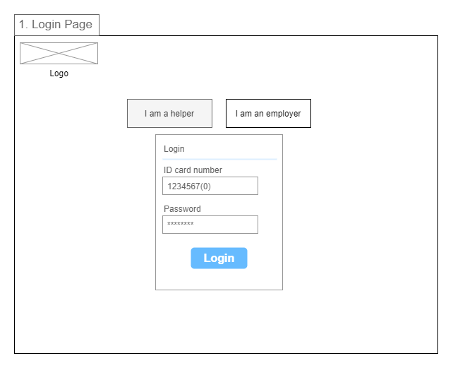

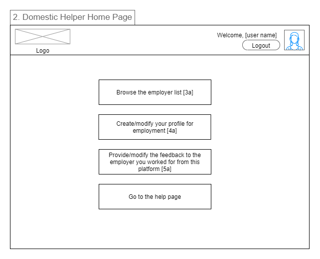

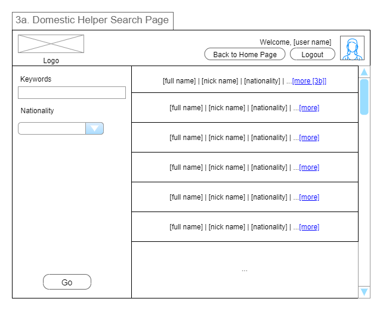

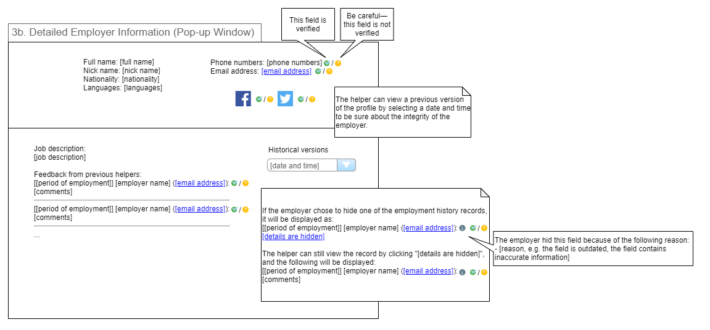

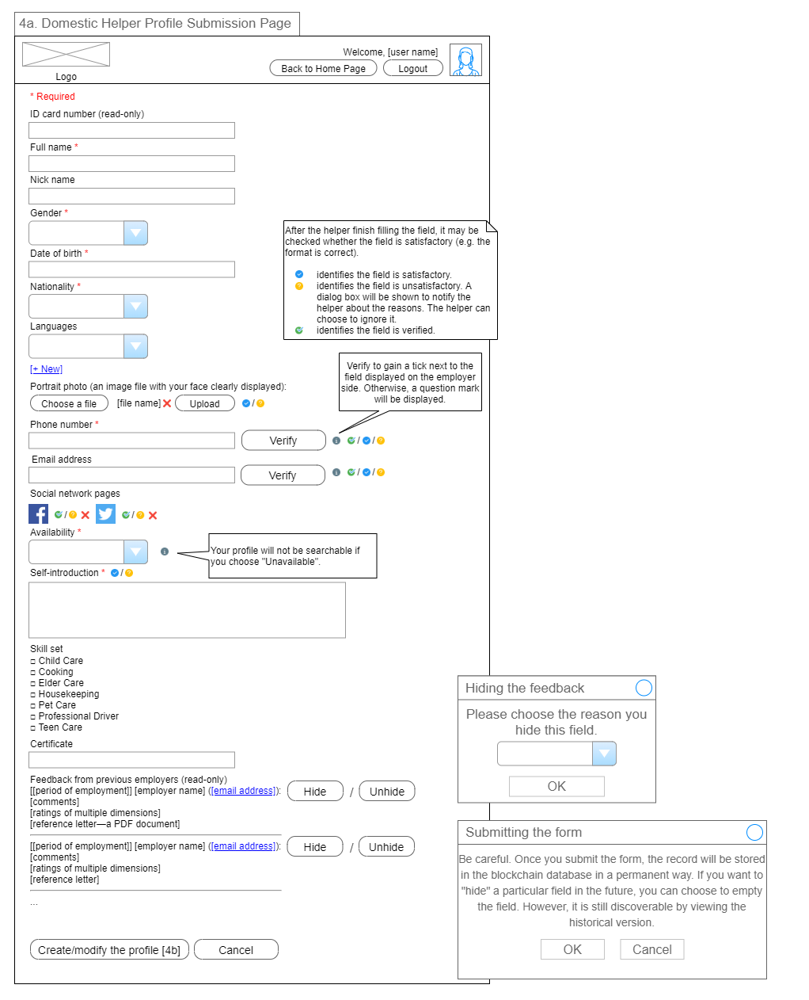

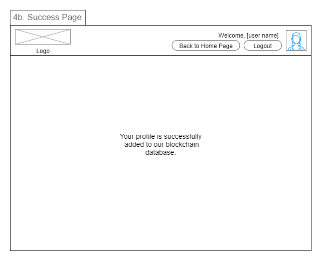

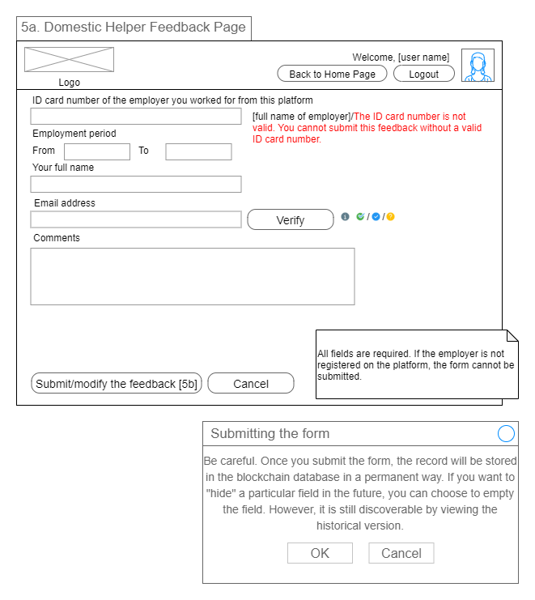

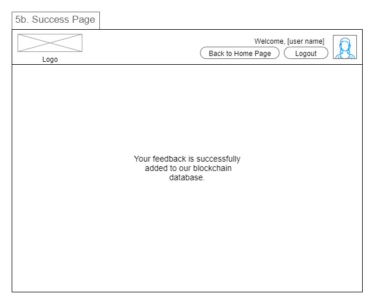

#### Different views for employers

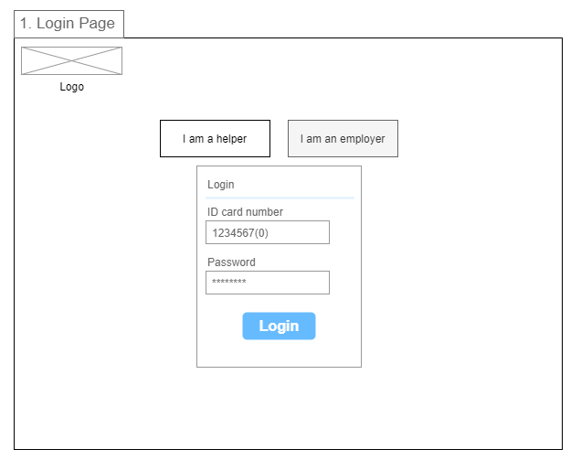

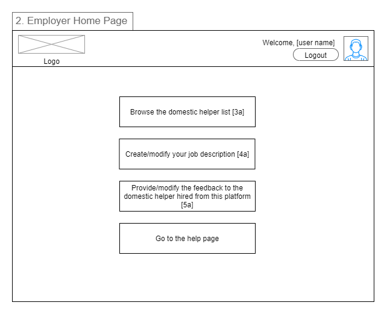

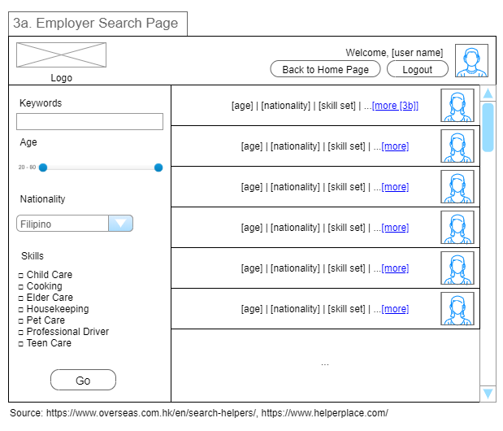

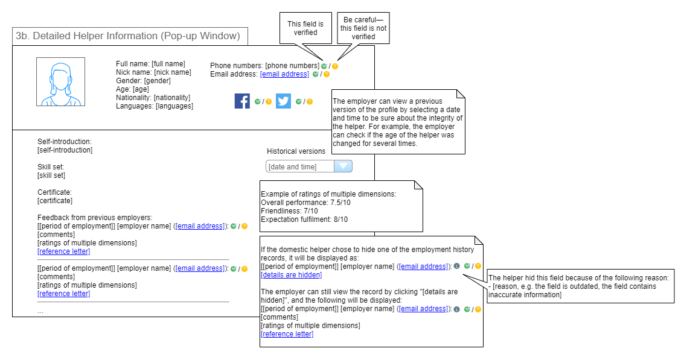

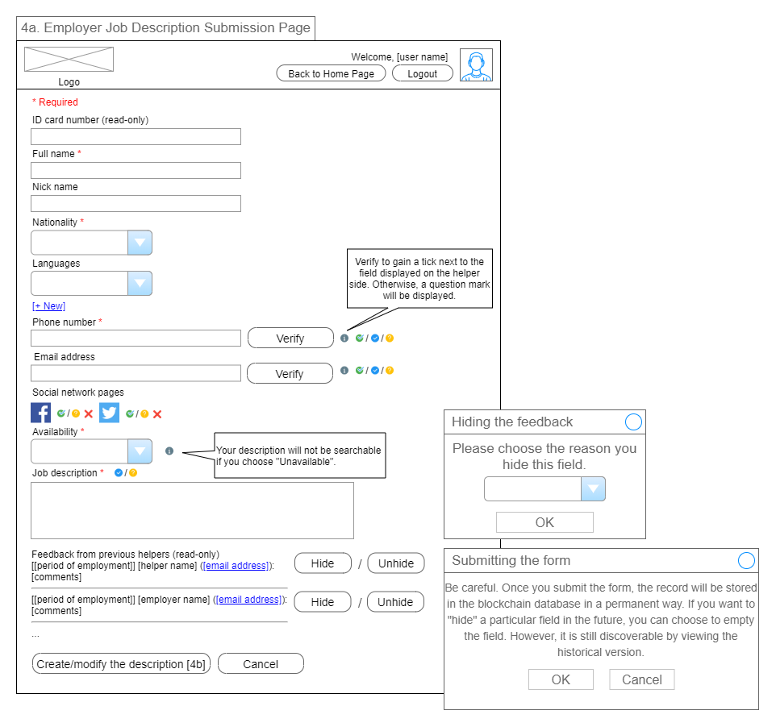

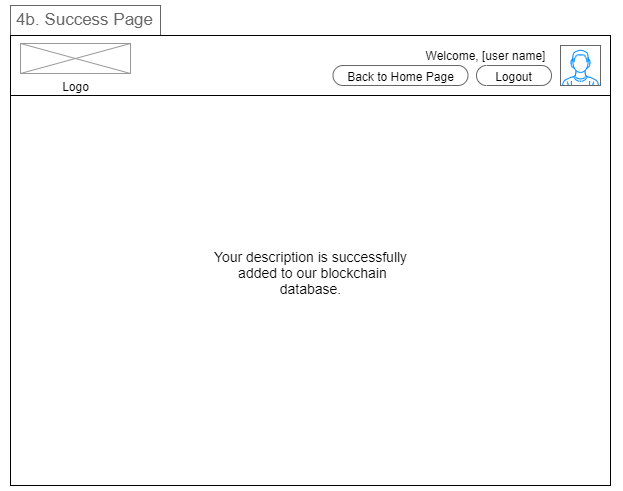

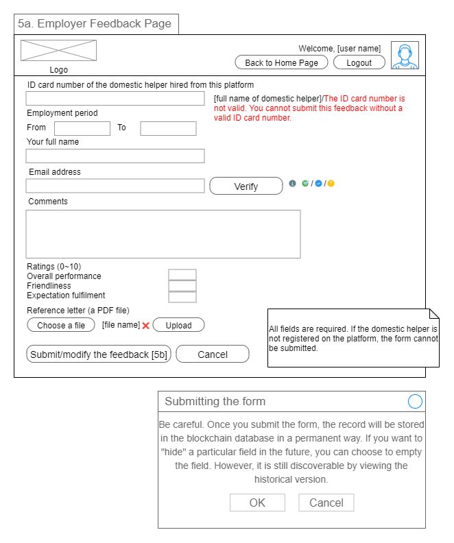

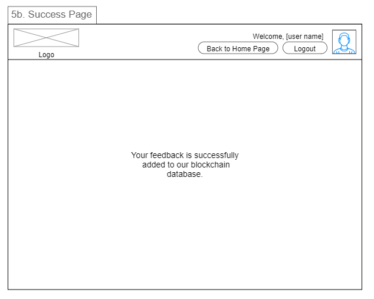

### 2.1.6. Network specifications

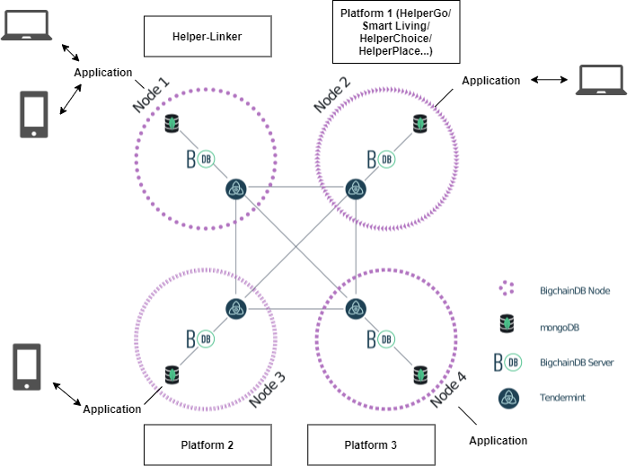

Figure 2.1.6.1: Decentralized Network

Our application's network configuration is shown in Figure 2.1.6.1<!-- (!) -->.
It is augmented from Figure 8.2.1<!-- (!) -->.
Apart from us (Helper-Linker), each other platform also hosts a node which presents our application, forming an application layer on top of the BigchainDB network.
The resulting network is thus decentralized.
This also helps us with load balancing the traffic to our application.
Note that our application does not replace their original application.

When there is a creation or modification of information initiated by a domestic helper or an employer from a platform which has joined our network, it will be recorded to the platform first, then to Helper-Linker and the BigchainDB network.
As it was mentioned before, other platforms benefit from the improved authenticity.
In addition, they also benefit from having extra helper and employer information shared in the network, which they can also present in their platform.
Yet, the heterogeneity of platforms is not compromised as they now share the same set of information.
The platforms can vary in the presentation, for instance, the perspectives platforms emphasize can be different—some platforms may lean more to the employer's perspective, some may lean more to the helper's perspective.

### 2.1.7. Data model

We adopted BigchainDB in our application.
BigchainDB exposes information stored in the blockchain via MongoDB, which is a NoSQL database.
Contrasting to relational databases, NoSQL databases feature flexible schema instead of being schema driven.
Also, NoSQL databases are friendly to horizontal scaling, meaning that they work well in clusters of servers [1].
Data in MongoDB are encoded in BSON, which provides additional data types to JSON [2].
Therefore, the fields we designed in Section 2.1.5<!-- (!) --> was stored in BSON documents with suitable data types.

Employer and helper details from different platforms differ in schema.
However, it is noted that since NoSQL databases feature flexible schema, the details with different schemas can be naturally recorded in our application without altering.

### References

<!-- The preferred reference style is IEEE reference style (version 11.12.2018). See <https://www.cse.ust.hk/ct/fyp/reports/content/ieee_style.html> and <http://journals.ieeeauthorcenter.ieee.org/wp-content/uploads/sites/7/IEEE-Reference-Guide.pdf>.
- Format for websites: [author names]. "[page title]." [website title]. [URL] (accessed [date of access (e.g. Mar. 1, 2000/ Mar. 2000)]).
- Format for books: [author names], "[chapter title]," in [book title (in italic type)], [edition number]th ed. [publisher city], [publisher US state], [publisher country]: [publisher name], [year], ch. [chapter number], sec. [section number], [page range].
- Format for online conference proceedings: [author names], "[paper title]," in [conference name (in italic type)], [year], [page range]. [Online]. Available: [URL]
- Format for lecture notes: [author names]. ([year]). [lecture title] [[type of medium]]. Available: [URL]
- Format for online manuals: [author names]. [manual title (in italic type)], [edition number]th ed. ([year]). Accessed: [date of access]. [Online]. Available: [URL]
- Format for online reports: [author names], "[report title]," [company name], [company city], [company US state], [company country], Rep. [report number], [date]. Accessed: [date of access]. [Online]. Available: [URL]
- Format for online videos: [video owner/creator], [location]. [video title (in italic type)]. [release date]. Accessed: [date of access]. [Online Video]. Available: [URL] -->
[1] <!-- Lecture note -->W. S. H. Ng. (2019). "NoSQL Databases (p. 7)." Database Management Systems (Dept. of Computer Science and Engineering, HKUST) [Powerpoint slides].\
[2] "JSON and BSON." MongoDB. <https://www.mongodb.com/json-and-bson> (accessed Feb. 27, 2020).
