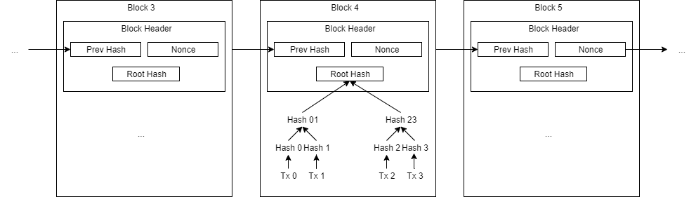
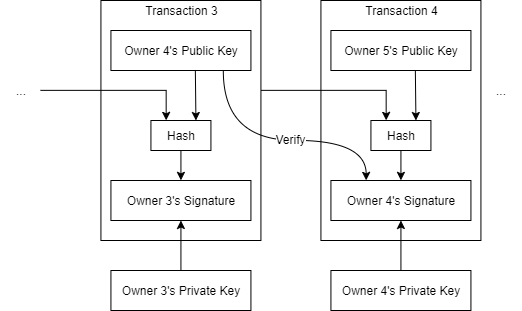
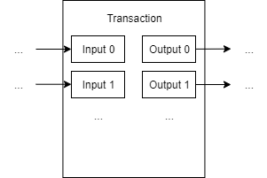

## 1.3. Literature Survey

### 1.3.1. Blockchain basics

Blockchain is a concept extracted from the well-known Bitcoin system [1] after it has been proved to be successful for recording payment records.
Blockchain is considered to have the following core features: decentralization, transparency and immutability [2].
There is no central authority to control blockchain.
It is controlled collectively by the peers in the blockchain network.
Communication is via a peer-to-peer system instead of a client-server system.
Thus, a blockchain system is decentralized.
When a user would like to add a transaction to the blockchain, the user should broadcast the transaction to the network.
The transactions are transparent to at least the blockchain peers.
Thus, a blockchain system is considered to be transparent.
Once a transaction is recorded on a blockchain, it is almost impossible to erase it.
If one wants to erase the transaction or to tamper with transactions in any way, one needs to convince the blockchain network that the tampered version of blockchain is the right one, which is extremely difficult.
Therefore, blockchain can be regarded as a write-only structure.

Figure 1.3.1: Blockchain Structure

The structure of blockchain in the Bitcoin white paper [1] is summarized in Figure 1.3.1<!-- (!) -->.
Transactions are encapsulated in blocks, which are then chained in a list.
New blocks are generated through proof of work.
The blockchain peers solve a cryptographic hashing problem, where the problem is adjusted to the difficulty such that the expected time to generate a new block is 10 minutes.
Suppose the attacker is $z$ blocks behind the longest chain (the chain everyone agrees on), the probability that the attacker finds the next block is $p$ and the probability the regular blockchain peers finds the next block is $q$, it can be shown that the probability the attacker surpasses regular blockchain peers is $1 - \sum_{k=0}^{z+1} \frac{\lambda^k e^{-\lambda}}{k!} \cdot \left( 1 - \left( \frac{q}{p} \right)^{z+1-k} \right)$, where $\lambda = z \frac{q}{p}$ [3].
Normally, with $p \gg q$ and $z$ large enough, it is virtually impossible that the attacker catches up and surpasses regular blockchain peers.

Figure 1.3.2: Transaction Structure

The transactions can be arranged as another chain as in Figure 1.3.2<!-- (!) -->, which represents the history of coin ownership.
The transactions represent a payment from owner 3 to owner 4, then from owner 4 to owner 5.
If B wants to fabricate a record "A transferred a coin to me", B needs A to digitally sign, (the hash of the previous transaction + the public key of the next owner (B)).
This is not possible since B does not have A's private key.

Figure 1.3.3: Transaction Inputs and Outputs

To enable divisible coins, a transaction may consist of several inputs and outputs as shown in Figure 1.3.3<!-- (!) -->.
Therefore, a payment value can come from multiple inputs and it can be split into multiple outputs.

One major criticism of the proof-of-work scheme is on its serious energy and resource consuming.
Currently, Bitcoin has an annual carbon footprint of about 34.75 Mt CO2 and consumes about 73.17 TWh of electricity.
The statistics are similar to those of medium-sized countries in Europe [4].
The energy and resources could have been spent on more useful usage.
Another major criticism is that the blockchain as the one in Bitcoin does not scale.
For Bitcoin, it can only handle around 7 transactions per second.
In comparison, VISA handles normally 7,000 transactions per second [5], with the carbon footprint per transaction being several orders of magnitude less [4].

### References

<!-- The preferred reference style is IEEE reference style (version 11.12.2018). See <https://www.cse.ust.hk/ct/fyp/reports/content/ieee_style.html> and <http://journals.ieeeauthorcenter.ieee.org/wp-content/uploads/sites/7/IEEE-Reference-Guide.pdf>.
- Format for websites: [author names]. "[page title]." [website title]. [URL] (accessed [date of access (e.g. Mar. 1, 2000/ Mar. 2000)]).
- Format for books: [author names], "[chapter title]," in [book title (in italic type)], [edition number]th ed. [publisher city], [publisher US state], [publisher country]: [publisher name], [year], ch. [chapter number], sec. [section number], [page range].
- Format for online conference proceedings: [author names], "[paper title]," in [conference name (in italic type)], [year], [page range]. [Online]. Available: [URL]
- Format for lecture notes: [author names]. ([year]). [lecture title] [[type of medium]]. Available: [URL]
- Format for online manuals: [author names]. [manual title (in italic type)], [edition number]th ed. ([year]). Accessed: [date of access]. [Online]. Available: [URL]
- Format for online reports: [author names], "[report title]," [company name], [company city], [company US state], [company country], Rep. [report number], [date]. Accessed: [date of access]. [Online]. Available: [URL]
- Format for online videos: [video owner/creator], [location]. [video title (in italic type)]. [release date]. Accessed: [date of access]. [Online Video]. Available: [URL] -->
[1] S. Nakamoto. "Bitcoin: A Peer-to-Peer Electronic Cash System." <https://bitcoin.org/bitcoin.pdf> (accessed Jul. 28, 2019).\
[2] A. Rosic. "What is Blockchain Technology? A Step-by-Step Guide For Beginners." Blockgeeks. <https://blockgeeks.com/guides/what-is-blockchain-technology/> (accessed Jun. 24, 2019).\
[3] A. P. Ozisik and B. N. Levine. "An Explanation of Nakamoto's Analysis of Double-spend Attacks (pp. 3–10)." arXiv. <https://arxiv.org/pdf/1701.03977.pdf> (accessed Aug. 31, 2019).\
[4] "Bitcoin Energy Consumption Index." Digiconomist. <https://digiconomist.net/bitcoin-energy-consumption> (accessed Feb. 7, 2020).\
[5] <!-- Book -->M. Swan, "Limitations," in *Blockchain: Blueprint for a New Economy*, 1st ed. Sebastopol, CA, USA: O'Reilly Media, 2015, ch. 6, p. 82.
