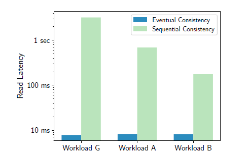

### 1.3.2. Blockchain databases

Rather than storing payment records on a blockchain, the blockchain can store other kinds of records, like records of asset ownership histories, records of different versions of documents.
It is natural to consider building a general-purpose database around blockchain (blockchain database).
The database (management system) can be regarded as a facade of the blockchain for easier manipulation of data, including querying, updating and sharing the data [6].
BlockchainDB [7] and BigchainDB [8] both implements a blockchain database.

#### BlockchainDB

The main work of the BlockchainDB team is devising a database layer upon an existing blockchain system.
The blockchain system constitutes a storage layer.
The team did not propose a new blockchain system.
Instead, their work extends an existing blockchain system.

Next, the database layer consists of several managers, namely the shard manager, transaction manager and verification manager.
This layer interacts with clients.
In BlockchainDB, data are sharded into different blockchain networks and into network peers.
Thus, there are more than one blockchain network.
The shard manager determines the destination shard of an operation (e.g. put and get operation) from clients.
The transaction manager allows the client to specify the consistency level.
It can be eventual consistency, sequential consistency, or bounded staleness, which is similar to eventual consistency, but the staleness of the data read by a client is limited.
The verification manager performs verification that prevents an attacker from dropping a put operation to a remote peer, or from returning a fake value for a get operation to a peer.

Figure 1.3.4: Effect of BlockchainDB Sharding on Throughput

Figure 1.3.5: Effect of BlockchainDB Consistency Level on Latency

The problems of the original blockchain as the one in Bitcoin described in the previous section are addressed.
One can deploy a more energy-efficient blockchain system in the storage layer, like the one that uses a proof-of-stake scheme.
Hence, the system can be more environmentally friendly.
As shown in Figure 1.3.4<!-- (!) -->, the BlockchainDB team showed, by experiments, that with more shards, the throughput of put operations increases linearly.
As shown in Figure 1.3.5<!-- (!) -->, with the consistency level set to be eventual consistency, the latency of get operations remains at a constantly low level.
We can see that the system scales well.

#### BigchainDB

Another line of work that implements a blockchain database comes from the BigchainDB team.
BigchainDB (more specifically, BigchainDB version 2.0) absorbs the advantages from big data database and blockchain.
It has essentially the same transaction model as Bitcoin as in Figure 1.3.2<!-- (!) -->.
Instead of coins being spent or transferred, BigchainDB generalizes them into "assets".
The content of an asset cannot be changed in later transactions after it has been created, but the accompanying metadata can be changed in later transactions to reflect, for example, the status of the asset, or other meaningful data.
The public keys in Figure 1.3.2<!-- (!) --> correspond to "conditions", while the signatures correspond to "fulfillments" in BigchainDB.
More complex conditions may be defined though.
For instance, one may require several specific signatures, rather than a signature in order to transfer an asset.
Such requirement is specified in a condition.
A transaction can also specify several inputs and outputs like the one in Figure 1.3.3<!-- (!) -->, so BigchainDB can also be used to issue divisible tokens [9].

Figure 1.3.6: A BigchainDB Network

Figure 1.3.6<!-- (!) --> shows a network configuration of BigchainDB [10].
All data stored in the blockchain network is presented in MongoDB.
Thus, BigchainDB inherits the query capabilities of MongoDB.
A consensus is reached via Tendermint, which is designed for tolerating Byzantine faults, allowing up to one-third of the peers being malicious.
Tendermint also features high performance, being able to process far more transactions per second when compared to the Bitcoin network, and drops the proof-of-work scheme that consumes a serious amount of electricity [11].
BigchainDB inherits those good properties as well.

Up to this point, both lines of work from BlockchainDB and BigchainDB implement a convincingly functional blockchain database that is environmentally friendly and scalable.
They should both suit our needs of building a blockchain database that connects employers and domestic helpers.
However, we expect more components will be ready for out-of-the-box BigchainDB since BigchainDB has been released and improved for some years.
Also, the documentation of it is more adequate.
On the other hand, BlockchainDB has not been released yet.
Only its paper is publicly available.
*Hence, due to an efficiency concern, we chose to use BigchainDB.*

### References

<!-- The preferred reference style is IEEE reference style (version 11.12.2018). See <https://www.cse.ust.hk/ct/fyp/reports/content/ieee_style.html> and <http://journals.ieeeauthorcenter.ieee.org/wp-content/uploads/sites/7/IEEE-Reference-Guide.pdf>.
- Format for websites: [author names]. "[page title]." [website title]. [URL] (accessed [date of access (e.g. Mar. 1, 2000/ Mar. 2000)]).
- Format for books: [author names], "[chapter title]," in [book title (in italic type)], [edition number]th ed. [publisher city], [publisher US state], [publisher country]: [publisher name], [year], ch. [chapter number], sec. [section number], [page range].
- Format for online conference proceedings: [author names], "[paper title]," in [conference name (in italic type)], [year], [page range]. [Online]. Available: [URL]
- Format for lecture notes: [author names]. ([year]). [lecture title] [[type of medium]]. Available: [URL]
- Format for online manuals: [author names]. [manual title (in italic type)], [edition number]th ed. ([year]). Accessed: [date of access]. [Online]. Available: [URL]
- Format for online reports: [author names], "[report title]," [company name], [company city], [company US state], [company country], Rep. [report number], [date]. Accessed: [date of access]. [Online]. Available: [URL]
- Format for online videos: [video owner/creator], [location]. [video title (in italic type)]. [release date]. Accessed: [date of access]. [Online Video]. Available: [URL] -->
[6] <!-- Lecture note -->W. S. H. Ng. (2019). "Introduction (p. 6)." Database Management Systems (Dept. of Computer Science and Engineering, HKUST) [Powerpoint slides].\
[7] <!-- Online conference proceedings -->M. El-Hindi et al., "BlockchainDB - A Shared Database on Blockchains," in *Proceedings of the VLDB Endowment*, 2019, pp. 1597–1609. [Online]. Available: <http://www.vldb.org/pvldb/vol12/p1597-el-hindi.pdf>\
[8] BigchainDB. <https://www.bigchaindb.com/> (accessed Feb. 10, 2020).\
[9] T. McConaghy. "BigchainDB Transactions Spec v2." GitHub. <https://github.com/bigchaindb/BEPs/tree/master/13> (accessed Dec. 26, 2019).\
[10] <!-- Online manual -->*Querying BigchainDB*. Accessed: Feb. 6, 2020. [Online]. Available: <https://docs.bigchaindb.com/en/latest/query.html>\
[11] R. Mitra. "What is Tendermint Core? The Most Comprehensive Guide Ever." Blockgeeks. <https://blockgeeks.com/guides/tendermint/> (accessed Feb. 10, 2020).
