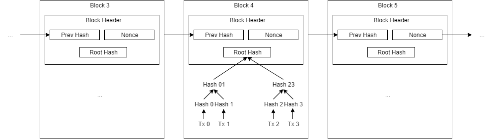
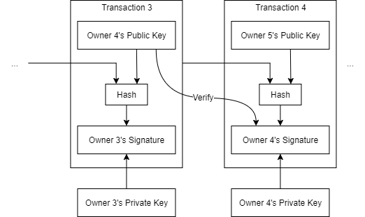
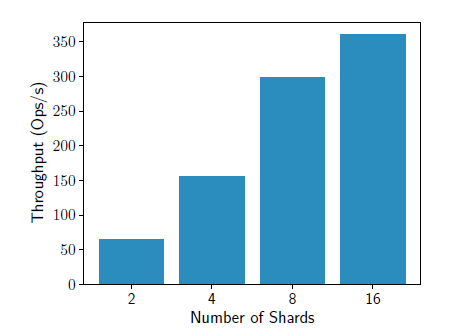
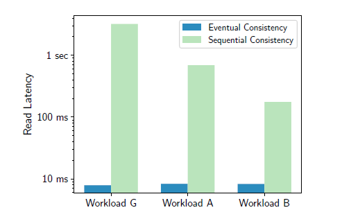
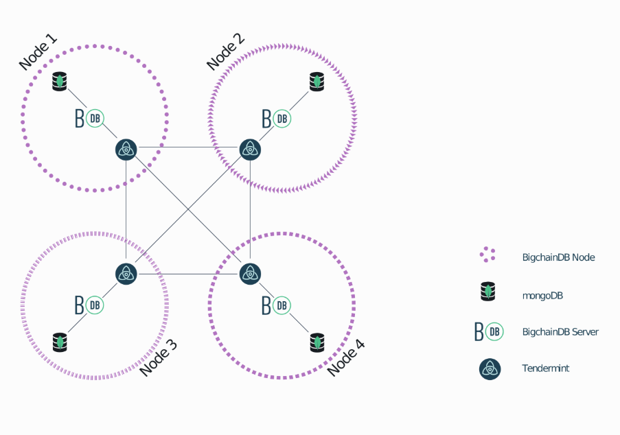

## 1.3. Literature Survey

### 1.3.1. Blockchain basics

Blockchain is a concept extracted from the well-known Bitcoin system [1] after it has been proved to be successful for recording payment records.
Blockchain is considered to have the following core features: decentralization, transparency and immutability [2].
There is no central authority to control blockchain.
It is controlled collectively by the peers in the blockchain network.
Communication is via a peer-to-peer system instead of a client-server system.
Thus, a blockchain system is decentralized.
When a user would like to add a transaction to the blockchain, the user should broadcast the transaction to the network.
The transactions are transparent to at least the blockchain peers.
Thus, a blockchain system is considered to be transparent.
Once a transaction is recorded on a blockchain, it is almost impossible to erase it.
If one wants to erase the transaction or to tamper with transactions in any way, one needs to convince the blockchain network that the tampered version of blockchain is the right one, which is extremely difficult.
Therefore, blockchain can be regarded as a write-only structure.

The structure of blockchain in the Bitcoin white paper [1] is summarized in Figure 1.3.1.
Transactions are encapsulated in blocks, which are then chained in a list.
New blocks are generated through proof of work.
The blockchain peers solve a cryptographic hashing problem, where the problem is adjusted to the difficulty such that the expected time to generate a new block is 10 minutes.
Suppose the attacker is $z$ blocks behind the longest chain (the chain everyone agrees on), the probability that the attacker finds the next block is $p$ and the probability the regular blockchain peers finds the next block is $q$, it can be shown that the probability the attacker surpasses regular blockchain peers is $1 - \sum_{k=0}^{z+1} \frac{\lambda^k e^{-\lambda}}{k!} \cdot \left( 1 - \left( \frac{q}{p} \right)^{z+1-k} \right)$, where $\lambda = z \frac{q}{p}$ [3].
Normally, with $p \gg q$ and $z$ large enough, it is virtually impossible that the attacker catches up and surpasses regular blockchain peers.

The transactions can be arranged as another chain as in Figure 1.3.2, which represents the history of coin ownership.
The transactions represent a payment from owner 3 to owner 4, then from owner 4 to owner 5.
If B wants to fabricate a record "A transferred a coin to me", B needs A to digitally sign, (the hash of the previous transaction + the public key of the next owner (B)).
This is not possible since B does not have A's private key.

To enable divisible coins, a transaction may consist of several inputs and outputs as shown in Figure 1.3.3.
Therefore, a payment value can come from multiple inputs and it can be split into multiple outputs.

One major criticism of the proof-of-work scheme is on its serious energy and resource consuming.
Currently, Bitcoin has an annual carbon footprint of about 34.75 Mt CO2 and consumes about 73.17 TWh of electricity.
The statistics are similar to those of medium-sized countries in Europe [4].
The energy and resources could have been spent on more useful usage.
Another major criticism is that the blockchain as the one in Bitcoin does not scale.
For Bitcoin, it can only handle around 7 transactions per second.
In comparison, VISA handles normally 7,000 transactions per second [5], with the carbon footprint per transaction being several orders of magnitude less [4].

### 1.3.2. Blockchain databases

Rather than storing payment records on a blockchain, the blockchain can store other kinds of records, like records of asset ownership histories, records of different versions of documents.
It is natural to consider building a general-purpose database around blockchain (blockchain database).
The database (management system) can be regarded as a facade of the blockchain for easier manipulation of data, including querying, updating and sharing the data [6].
BlockchainDB [7] and BigchainDB [8] both implements a blockchain database.

#### BlockchainDB

The main work of the BlockchainDB team is devising a database layer upon an existing blockchain system.
The blockchain system constitutes a storage layer.
The team did not propose a new blockchain system.
Instead, their work extends an existing blockchain system.

Next, the database layer consists of several managers, namely the shard manager, transaction manager and verification manager.
This layer interacts with clients.
In BlockchainDB, data are sharded into different blockchain networks and into network peers.
Thus, there are more than one blockchain network.
The shard manager determines the destination shard of an operation (e.g. put and get operation) from clients.
The transaction manager allows the client to specify the consistency level.
It can be eventual consistency, sequential consistency, or bounded staleness, which is similar to eventual consistency, but the staleness of the data read by a client is limited.
The verification manager performs verification that prevents an attacker from dropping a put operation to a remote peer, or from returning a fake value for a get operation to a peer.

The problems of the original blockchain as the one in Bitcoin described in the previous section are addressed.
One can deploy a more energy-efficient blockchain system in the storage layer, like the one that uses a proof-of-stake scheme.
Hence, the system can be more environmentally friendly.
As shown in Figure 1.3.4, the BlockchainDB team showed, by experiments, that with more shards, the throughput of put operations increases linearly.
As shown in Figure 1.3.5, with the consistency level set to be eventual consistency, the latency of get operations remains at a constantly low level.
We can see that the system scales well.

#### BigchainDB

Another line of work that implements a blockchain database comes from the BigchainDB team.
BigchainDB (more specifically, BigchainDB version 2.0) absorbs the advantages from big data database and blockchain.
It has essentially the same transaction model as Bitcoin as in Figure 1.3.2.
Instead of coins being spent or transferred, BigchainDB generalizes them into "assets".
The content of an asset cannot be changed in later transactions after it has been created, but the accompanying metadata can be changed in later transactions to reflect, for example, the status of the asset, or other meaningful data.
The public keys in Figure 1.3.2 correspond to "conditions", while the signatures correspond to "fulfillments" in BigchainDB.
More complex conditions though may be defined though.
For instance, one may require several specific signatures, rather than a signature in order to transfer an asset.
Such requirement is specified in a condition.
A transaction can also specify several inputs and outputs like the one in Figure 1.3.3, so BigchainDB can also be used to issue divisible tokens [9].

Figure 1.3.6 shows a network configuration of BigchainDB [10].
All data stored in the blockchain network is presented in MongoDB.
Thus, BigchainDB inherits the query capabilities of MongoDB.
A consensus is reached via Tendermint, which is designed for tolerating Byzantine faults, allowing up to one-third of the peers being malicious.
Tendermint also features high performance, being able to process far more transactions per second when compared to the Bitcoin network, and drops the proof-of-work scheme that consumes a serious amount of electricity [11].
BigchainDB inherits those good properties as well.

Up to this point, both lines of work from BlockchainDB and BigchainDB implement a convincingly functional blockchain database that is environmentally friendly and scalable.
They should both suit our needs of building a blockchain database that connects employers and domestic helpers.
However, we expect more components will be ready for out-of-the-box BigchainDB since BigchainDB has been released and improved for some years.
Also, the documentation of it is more adequate.
On the other hand, BlockchainDB has not been released yet.
Only its paper is publicly available.
Hence, due to an efficiency concern, we chose to use BigchainDB<!-- (?) -->.

### 1.3.3. Existing business models

The business model of our project is inspired by existing models including those in local domestic helper agencies, online direct hiring platforms, and blockchain-based systems in other industries.

#### Local domestic helper agencies

As for hiring a domestic helper, some employers would seek assistance from agencies.
Examples of such agencies include Arrow Employment Services [12], Fair Employment Agency [13], Lotus Employment Agency [14] and Overseas Employment Centre [15].
Arrow Employment Services and Fair Employment Agency offer services for hiring both local and foreign domestic helpers, while Lotus Employment Agency and Overseas Employment Centre focus on services for hiring foreign domestic helpers.

Those agencies have years of experience.
For instance, Overseas Employment Centre was established in 1976 and has experience of nearly half a century.
With such experience, they can help employers with finding and interviewing domestic helpers, and completing essential documents in a convenient manner.
Employers can as well as consult those agencies for professional suggestions.
Normally, without agencies, employers, especially the inexperienced ones have to go through lengthy, yet essential forms or guidance notes from the Hong Kong Immigration Department [16] on their own.
With agencies, their time and effort are saved.
The risk of employers inadvertently breaching regulations is also lowered.
Besides, agencies offer additional services, which is ideal for an employer looking for a one-stop service.
For instance, Overseas Employment Centre has dedicated training centres for foreign helpers in their home countries.
The centre also has an organisation "Smile Club" for Indonesian helpers which organizes activities for their welfare.
Agencies can provide follow-up services as well, like translation service that reduces language barriers between employers and foreign helpers.

| Agency Name                | Price for hiring a foreign helper | Price for hiring a local helper |
| -------------------------- | --------------------------------- | ------------------------------- |
| Arrow Employment Services  | $9,800                            | $6,500                          |
| Fair Employment Agency     | $9,900                            | $5,000                          |
| Lotus Employment Agency    | $9,403 up                         | -                               |
| Overseas Employment Centre | $7,980 up                         | -                               |
Table 1.3.1: Prices for Typical Service Packages

One downside of involving an agency is that it introduces extra costs for employers and helpers.
Table 1.3.1 shows the prices for typical service packages for some agencies as listed in their official websites.
The extra costs are surely significant.
Also, agencies are criticized for charging helpers placement fees [17].
And as it was previously discussed, it is not guaranteed that the information provided by agencies are accurate.
From the helper profiles given by agencies' websites, it is observed that only positive information is listed.
There is a chance that negative aspects in helper profiles are hidden by agencies.
However, if blockchain is used for storing helpers' profiles as in our application, this issue is prevented since the profile histories would be transparent.
Similarly, agencies may also hide negative aspects of certain employers, like the high turnover of helpers, their large families to take care of, from helpers.
Thus, we ask employers to provide their information as well.
We also allow both parties, employers and helpers, to provide feedback to each other in our application, so as to reveal more potential problems.

#### Online direct hiring platforms

Hiring domestic helpers directly without involving agencies is also a viable option in Hong Kong.
This can be done through online direct hiring platforms like HelperGo [18], Smart Living [19], HelperChoice [20] and HelperPlace [21].
HelperGo and Smart Living are platforms for local domestic helpers.
HelperChoice and HelperPlace are platforms for foreign domestic helpers, while one can also find helpers from Hong Kong in HelperPlace.
Some platforms maintain a database for domestic helper profiles (e.g. HelperGo, HelperChoice).
Some maintain a database for job vacancies from employers (e.g. Smart Living).
Some maintain both (e.g. HelperPlace).

These platforms are more flexible than agencies.
Notably, employers can order one-time, or regular services through platforms for local helpers.
Some examples of such services include cooking, massage and house cleaning.
In comparison, domestic helper agencies focus more on assisting employers in hiring foreign domestic helpers.
There is only one standard contract for foreign domestic helpers, which is always effective for two years, and the helpers cannot take any part-time jobs [22].
Through online direct hiring platforms, employers can choose to go for direct hiring, but they can still choose to involve agencies.
If an employer chooses direct hiring, the commission for an agency is saved.
Online direct hiring platforms are more economical for employers in this sense.

However, it will be time consuming to go through necessary paperwork without the help from an agency given that an employer chooses direct hiring.
The employer will also lose other benefits from the agency, like having follow-up services as mentioned.
In addition, it is observed that profile histories are not available on the platforms.
This gives helpers opportunities to modify the profiles in a dishonest and inconsistent way without leaving any traces.
For instance, a helper may exaggerate in an experience description which contradicts to the previous version of the description.
Again, this issue will be prevented if blockchain is used for storing profiles.

Our project leans more towards online direct hiring platforms<!-- (?) -->.
An online direct hiring platform is more flexible, where an employer can still choose whether to involve an agency.
We then give attributes (i.e. decentralization, transparency and immutability) from blockchain upon the platform such that the data presented to the end users are more credible.
This direction is also explored by MamaHelpers, a network serving employers, helpers and agencies.
According to a proposal provided by an informant from MamaHelpers [23], utilizing blockchain resolves helper backing-out issue.
After an employer and a helper signing a contract, the helper may back out and sign another contract from an employer who provides better conditions.
This turns out to be a pain point for direct hiring.
However, with the help of blockchain, helpers would less likely back out since this can leave a permanent record in the blockchain.

#### Blockchain-based systems in other industries

There are blockchain-based systems built for other industries.
For example, Provenance is the platform that utilizes blockchain technology for recording the information produced along the supply chain [24].
With such platform, consumers can verify if the product they buy is genuine/ethical/sustainable.
A wine authentication system by blockchain company Guardtime, which is currently under development, also aims for a similar goal [25].
The BigchainDB (a blockchain database) team shared their collaboration with RWE (an energy provider in Germany).
The resulting system enables the communication of different small energy providers, the management of cash flows in a decentralized way under the energy deregulation in Germany [26].
Estonia, which is known for having digital society, claimed itself to be a blockchain nation [27].
Several governmental services are integrated with blockchain such that citizens receive more control to their data.
For example, citizens can know who has accessed their data exactly with the help of blockchain.

From Estonia's experience, blockchain technology should be combined with verified identities and a policy framework.
It is necessary to verify the identities of blockchain users to ensure that they are not fraudulent at the beginning.
Nevertheless, this induces high costs for blockchain startups.
Despite Estonia's effort to tackle this issue with e-Residency, a digital identity issued by the government, it is for EU-based companies only [28].
Further, there is a temptation to turn blockchain technology into snake oil, where blockchain technology serves more like a gimmick to attract investment.
One criticism of Estonia's claim of having integrated blockchain into the governmental system [27] is that the details showing that the blockchain system implementation is indeed reliable, are lacking.
Mentioning blockchain in this situation would be more like a marketing strategy than being practical.
Also, whether using blockchain to achieve immutability, decentralization, etc. is necessary, is a problem that requires serious consideration.

Regarding the issue of having to verify identities, our current concept is to use users' ID card numbers from their original countries/regions as the unique IDs<!-- (?) -->.
This can at least prevent a user from registering our application multiple times with, for example, multiple email addresses.
As a result, we have basic authenticity for our application.
In order to build a legitimate blockchain system, it should be maintained collectively.
The peers controlling the system should be non-collaborative.
In the case of manufacturing industry, they may be different parties in the supply chain; in the case of energy industry, they may be different energy providers; in the case of governance, they may be different departments that are not collaborating.
One plausible solution for our application is to reach out to several existing platforms and convince them to join our blockchain network<!-- (?) -->.
(This makes our blockchain system a private blockchain system.)
They can share the helpers' and possibly employers' information held into the blockchain network.
Improving the authenticity of their data stored could incentivize the platforms to join the network.
Therefore, our application would also behave like an integrated platform that integrates several existing platforms.

### References

<!-- The preferred reference style is IEEE reference style (version 11.12.2018). See <https://www.cse.ust.hk/ct/fyp/reports/content/ieee_style.html> and <http://journals.ieeeauthorcenter.ieee.org/wp-content/uploads/sites/7/IEEE-Reference-Guide.pdf>.
- Format for websites: [author names]. "[page title]." [website title]. [URL] (accessed [date of access (e.g. Mar. 1, 2000/ Mar. 2000)]).
- Format for books: [author names], "[chapter title]," in [book title (in italic type)], [edition number]th ed. [publisher city], [publisher US state], [publisher country]: [publisher name], [year], ch. [chapter number], sec. [section number], [page range].
- Format for online conference proceedings: [author names], "[paper title]," in [conference name (in italic type)], [year], [page range]. [Online]. Available: [URL]
- Format for lecture notes: [author names]. ([year]). [lecture title] [[type of medium]]. Available: [URL]
- Format for online manuals: [author names]. [manual title (in italic type)], [edition number]th ed. ([year]). Accessed: [date of access]. [Online]. Available: [URL]
- Format for online reports: [author names], "[report title]," [company name], [company city], [company US state], [company country], Rep. [report number], [date]. Accessed: [date of access]. [Online]. Available: [URL]
- Format for online videos: [video owner/creator], [location]. [video title (in italic type)]. [release date]. Accessed: [date of access]. [Online Video]. Available: [URL] -->
[1] S. Nakamoto. "Bitcoin: A Peer-to-Peer Electronic Cash System." <https://bitcoin.org/bitcoin.pdf> (accessed Jul. 28, 2019).\
[2] A. Rosic. "What is Blockchain Technology? A Step-by-Step Guide For Beginners." Blockgeeks. <https://blockgeeks.com/guides/what-is-blockchain-technology/> (accessed Jun. 24, 2019).\
[3] A. P. Ozisik and B. N. Levine. "An Explanation of Nakamoto's Analysis of Double-spend Attacks (pp. 3–10)." arXiv. <https://arxiv.org/pdf/1701.03977.pdf> (accessed Aug. 31, 2019).\
[4] "Bitcoin Energy Consumption Index." Digiconomist. <https://digiconomist.net/bitcoin-energy-consumption> (accessed Feb. 7, 2020).\
[5] <!-- Book -->M. Swan, "Limitations," in *Blockchain: Blueprint for a New Economy*, 1st ed. Sebastopol, CA, USA: O'Reilly Media, 2015, ch. 6, p. 82.\
[6] <!-- Lecture note -->W. S. H. Ng. (2019). "Introduction (p. 6)." Database Management Systems (Dept. of Computer Science and Engineering, HKUST) [Powerpoint slides].\
[7] <!-- Online conference proceedings -->M. El-Hindi et al., "BlockchainDB - A Shared Database on Blockchains," in *Proceedings of the VLDB Endowment*, 2019, pp. 1597–1609. [Online]. Available: <http://www.vldb.org/pvldb/vol12/p1597-el-hindi.pdf>\
[8] BigchainDB. <https://www.bigchaindb.com/> (accessed Feb. 10, 2020).\
[9] T. McConaghy. "BigchainDB Transactions Spec v2." GitHub. <https://github.com/bigchaindb/BEPs/tree/master/13> (accessed Dec. 26, 2019).\
[10] <!-- Online manual -->*Querying BigchainDB*. Accessed: Feb. 6, 2020. [Online]. Available: <https://docs.bigchaindb.com/en/latest/query.html>\
[11] R. Mitra. "What is Tendermint Core? The Most Comprehensive Guide Ever." Blockgeeks. <https://blockgeeks.com/guides/tendermint/> (accessed Feb. 10, 2020).\
[12] Arrow Employment Services. <https://www.arrowes.hk/> (accessed Feb. 7, 2020).\
[13] Fair Employment Agency. <https://www.fairagency.org/> (accessed Feb. 7, 2020).\
[14] Lotus Employment Agency. <https://lotusmaid.com.hk:446/web/html/eng/index.jsp> (accessed Feb. 7, 2020).\
[15] Overseas Employment Centre. <https://www.overseas.com.hk/en/> (accessed Feb. 7, 2020).\
[16] "Employment of Domestic Helpers from Abroad." Hong Kong Immigration Department. <https://www.immd.gov.hk/eng/forms/hk-visas/foreign-domestic-helpers.html> (accessed Feb. 7, 2020).\
[17] "Our Story." Fair Employment Agency. <https://www.fairagency.org/our-story/> (accessed Feb. 7, 2020).\
[18] HelperGo. <https://www.helpergo.co/> (accessed Feb. 7, 2020).\
[19] Smart Living. <https://www.erb.org/smartliving/en/main/> (accessed Feb. 7, 2020).\
[20] HelperChoice. <https://www.helperchoice.com/> (accessed Feb. 7, 2020).\
[21] HelperPlace. <https://www.helperplace.com/> (accessed Feb. 7, 2020).\
[22] "Standard Employment Contract and Terms of Employment for Helpers." Hong Kong Immigration Department. <https://www.immd.gov.hk/eng/forms/forms/fdhcontractterms.html> (accessed Feb. 7, 2020).\
[23] <!-- Unpublished material -->T. Y. So, "Domestic Helper Blockchain Database Research Proposal," unpublished.\
[24] Provenance. <https://www.provenance.org/> (accessed Feb. 7, 2020).\
[25] "Estonian-founded Guardtime to build wine authentication system in Australia." e-Estonia. <https://e-estonia.com/guardtime-wine-authentication-system/> (accessed Feb. 7, 2020).\
[26] <!-- Online video -->T. McConaghy, Berlin. *Trent McConaghy - BigchainDB: a Scalable Blockchain Database, in Python*. May 31, 2016. Accessed: Jan. 2, 2020. [Online Video]. Available: <https://www.youtube.com/watch?v=1NHHmHVCWy0>\
[27] K. Korjus. "Welcome to the blockchain nation." Medium. <https://medium.com/e-residency-blog/welcome-to-the-blockchain-nation-5d9b46c06fd4> (accessed Feb. 7, 2020).\
[28] "What is e-Residency." Knowledge Base. <https://learn.e-resident.gov.ee/hc/en-us/articles/360000711978-What-is-e-Residency> (accessed Feb. 7, 2020).
