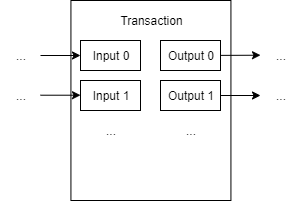

## 1.3. Literature Survey

### 1.3.1. Blockchain basics

Blockchain is a concept extracted from the well-known Bitcoin system [1] after it has been proved to be successful for recording payment records.
Blockchain is considered to have the following core features: decentralization, transparency and immutability [2].
There is no central authority to control blockchain.
It is controlled collectively by the peers in the blockchain network.
Communication is via a peer-to-peer system instead of a client-server system.
Thus, a blockchain system is decentralized.
When a user would like to add a transaction to the blockchain, the user should broadcast the transaction to the network.
The transactions are transparent to at least the blockchain peers.
Thus, a blockchain system is considered to be transparent.
Once a transaction is recorded on a blockchain, it is almost impossible to erase it.
If one wants to erase the transaction or to tamper with transactions in any way, one needs to convince the blockchain network that the tampered version of blockchain is the right one, which is extremely difficult.
Therefore, blockchain can be regarded as a write-only structure.

The structure of blockchain in the Bitcoin white paper [1] is summarized in Figure 1.3.1.
Transactions are encapsulated in blocks, which are then chained in a list.
New blocks are generated through proof-of-work.
The blockchain peers solve a cryptographic hashing problem, where the problem is adjusted to the difficulty such that the expected time to generate a new block is 10 minutes.
Suppose the attacker is $z$ blocks behind the longest chain (the chain everyone agrees on), the probability that the attacker finds the next block is $p$ and the probability the regular blockchain peers finds the next block is $q$, it can be shown that the probability the attacker surpasses regular blockchain peers is $1 - \sum_{k=0}^{z+1} \frac{\lambda^k e^{-\lambda}}{k!} \cdot \left( 1 - \left( \frac{q}{p} \right)^{z+1-k} \right)$, where $\lambda = z \frac{q}{p}$ [3].
Normally, with $p \gg q$ and $z$ large enough, it is virtually impossible that the attacker catches up and surpasses regular blockchain peers.

The transactions can be arranged as another chain as in Figure 1.3.2, which represents the history of coin ownership.
The transactions represent a payment from owner 3 to owner 4, then from owner 4 to owner 5.
If B wants to fabricate a record "A transferred a coin to me", B needs A to digitally sign, (the hash of the previous transaction + the public key of the next owner (B)).
This is not possible since B does not have A's private key.

To enable divisible coins, a transaction may consist of several inputs and outputs as shown in Figure 1.3.3.
Therefore, a payment value can come from multiple inputs and it can be split into multiple outputs.

One major criticism of the proof-of-work scheme is on its serious energy and resource consuming.
Currently, Bitcoin has an annual carbon footprint of about 34.75 Mt CO2 and consumes about 73.17 TWh of electricity.
The statistics are similar to those of medium-sized countries in Europe [4].
The energy and resources could have been spent on more useful usage.
Another major criticism is that the blockchain as in Bitcoin does not scale.
For Bitcoin, it can only handle around 7 transactions per second.
In comparison, VISA handles normally 7,000 transactions per second [5], with the carbon footprint per transaction being several orders of magnitude less [4].

### 1.3.2. Blockchain for data sharing

### 1.3.3. Existing business models

The business model of our project is inspired by existing models including those in local domestic helper agencies, online direct hiring platforms, and blockchain-based platforms in other industries.

#### Local domestic helper agencies

Some employers would seek assistance from agencies to hire domestic helpers.
Examples of such agencies include Arrow Employment Services [6], Fair Employment Agency [7], Lotus Employment Agency [8] and Overseas Employment Centre [9].
Arrow Employment Services and Fair Employment Agency offer services for hiring both local and foreign domestic helpers, while Lotus Employment Agency and Overseas Employment Centre focus on services for hiring foreign domestic helpers.
Those agencies have years of experience.
For instance, Overseas Employment Centre was established in 1976 and has experience of nearly half a century.
With such experience, they can help employers with finding and interviewing domestic helpers, and completing essential documents in a convenient manner.
Employers can as well as consult those agencies for professional suggestions.
Normally, without agencies, employers, especially the inexperienced ones have to go through lengthy, yet essential forms or guidance notes from the Hong Kong Immigration Department [10] on their own.
With agencies, their time and effort are saved.
The risk of employers inadvertently breaching regulations is also lowered.
Besides, agencies offer additional services, which is ideal for an employer looking for a one-stop service.
For instance, Overseas Employment Centre has dedicated training centres for foreign helpers in their home countries.
The centre also has an organisation "Smile Club" for Indonesian helpers which organizes activities for their welfare.
Agencies can provide follow-up services as well, like translation service that reduces language barriers between employers and foreign helpers.

| Agency Name                | Price for hiring a foreign helper | Price for hiring a local helper |
| -------------------------- | --------------------------------- | ------------------------------- |
| Arrow Employment Services  | $9,800                            | $6,500                          |
| Fair Employment Agency     | $9,900                            | $5,000                          |
| Lotus Employment Agency    | $9,403 up                         | -                               |
| Overseas Employment Centre | $7,980 up                         | -                               |
Table 1.3.1: Prices for Typical Service Packages

One downside of involving an agency is that it introduces extra costs for employers and helpers.
Table 1.3.1 shows the prices for typical service packages for some agencies as listed in their official websites.
Also, agencies are criticized for charging helpers placement fees [11].
And as it is previously discussed, it is not guaranteed that the helper profiles provided by agencies are accurate.
There is no incentives for agencies to provide less than satisfactory information to employers.
From the helper profiles given by agencies' websites, it is observed that only positive information is listed.
There is a chance that helper profiles are enhanced by agencies to attract employers.
However, if blockchain is used for storing helpers' profiles as in our system, this issue is prevented since the profile histories would be transparent.
We would also allow an employer to provide feedback to the helper hired in our system, so future employers can have a more complete picture about that helper.
Yet, employer feedback is not available in agency websites we have checked.

#### Online direct hiring platforms

Hiring domestic helpers directly without involving agencies is also a viable option in Hong Kong.
This can be done through online direct hiring platforms like HelperGo [12], Smart Living [13], HelperChoice [14] and HelperPlace [15].
HelperGo and Smart Living are platforms for local domestic helpers.
HelperChoice and HelperPlace are platforms for foreign domestic helpers, while one can also find helpers from Hong Kong in HelperPlace.
Some platforms maintain a database for domestic helper profiles (e.g. HelperGo, HelperChoice).
Some maintain a database for job vacancies from employers (e.g. Smart Living).
Some maintain both (e.g. HelperPlace).

These platforms are more flexible than agencies.
Notably, employers can order one-time, or regular services through platforms for local helpers.
Some examples of such services include cooking, massage and house cleaning.
In comparison, domestic helper agencies focus more on assisting employers in hiring foreign domestic helpers.
There is only one standard contract for foreign domestic helpers, which is always effective for two years, and the helpers cannot take any part-time jobs [16].
Through online direct hiring platforms, employers can choose to go for direct hiring, but they can still choose to involve agencies.
If an employer chooses direct hiring, the commission for an agency is saved.
Online direct hiring platforms are more economical for employers in this sense.

However, it will be time consuming to go through necessary paperwork given that an employer chooses direct hiring.
The employer will also lose other benefits from an agency, like having follow-up services as mentioned.
In addition, it is observed that profile histories are not available on the platforms.
This gives helpers opportunities to modify the profiles in a dishonest and inconsistent way without leaving any traces.
For instance, a helper may exaggerate in an experience description which contradicts to the previous version of the description.
Again, this issue will be prevented if blockchain is used for storing profiles.

Our project leans more towards online direct hiring platforms.
An online direct hiring platform is more flexible, where an employer can still choose whether to involve an agency.
We then give attributes (i.e. decentralization, transparency and immutability) from blockchain upon the platform such that the data presented to the end users are more credible.
This direction is also explored by MamaHelpers, a network serving employers, helpers and agencies.
According to a proposal provided by an informant from MamaHelpers, utilizing blockchain resolves helper backing-out issue.
After an employer and a helper signing a contract, the helper may back out and sign another contract from an employer who provides better conditions.
This turns out to be a pain point for direct hiring.
However, with the help of blockchain, helpers would less likely back out since this can leave a permanent record in the blockchain.

#### Blockchain-based platforms in other industries

Although not focused on domestic helpers, there are blockchain-based platforms built for other industries, such as Guardtime's wine authentication [17] and RMIT's land management systems [18].
Such platforms utilised blockchain's advantage to prevent superficial information since all data appended to blockchain are traceable.
Further applications on blockchain come from Estonia where most public services have built with a secure digital infrastructure [19].
However, the high cost of verification slows down the extensile uses of blockchain technology.

<!-- Pros: anti-tamper

Cons:
- high cost to verify
- Wine Authentication by Guardtime

https://e-estonia.com/guardtime-wine-authentication-system (Land management systems by RMIT)
https://www.rmit.edu.au/news/all-news/2019/march/blockchain-for-better-land-management-systems (e-Residency, eID, healthcare registry in Estonia)
https://medium.com/e-residency-blog/welcome-to-the-blockchain-nation-5d9b46c06fd4
https://learn.e-resident.gov.ee/hc/en-us/articles/360000711978-What-is-e-Residency -->

### References

<!-- A template for the IEEE reference style (October 2016) according to <https://www.cse.ust.hk/ct/fyp/reports/content/ieee_style.html> and <https://ieeecs-media.computer.org/assets/pdf/2016CSStyleGuide.pdf>: <author names>, "<title>," <publication name (in italic type)>, <publisher name>, <date (e.g. 15 Mar. 2000)>, <page range>; <URL>. -->
[1] S. Nakamoto, "Bitcoin: A Peer-to-Peer Electronic Cash System," 2008; <https://bitcoin.org/bitcoin.pdf>.\
[2] A. Rosic, "What is Blockchain Technology? A Step-by-Step Guide For Beginners," *Blockgeeks*, 1 Mar. 2019; <https://blockgeeks.com/guides/what-is-blockchain-technology/>.\
[3] A.P. Ozisik and B.N. Levine, "An Explanation of Nakamoto's Analysis of Double-spend Attacks," *arXiv*, 15 Jan. 2017, pp. 3–10; <https://arxiv.org/pdf/1701.03977.pdf>.\
[4] "Bitcoin Energy Consumption Index," *Digiconomist*, 2020; <https://digiconomist.net/bitcoin-energy-consumption>.\
[5] M. Swan, "Blockchain: Blueprint for a New Economy," *O'Reilly Media*, 24 Jan. 2015, p. 82; <https://books.google.com.hk/books?id=4vFiBgAAQBAJ>.\
[6] Arrow Employment Services; <https://www.arrowes.hk/>.\
[7] Fair Employment Agency; <https://www.fairagency.org/>.\
[8] Lotus Employment Agency; <https://lotusmaid.com.hk:446/web/html/eng/index.jsp>.\
[9] Overseas Employment Centre; <https://www.overseas.com.hk/en/>.\
[10] "Employment of Domestic Helpers from Abroad," Hong Kong Immigration Department, 26 Nov. 2019; <https://www.immd.gov.hk/eng/forms/hk-visas/foreign-domestic-helpers.html>.\
[11] "Our Story," Fair Employment Agency; <https://www.fairagency.org/our-story/>.\
[12] HelperGo; <https://www.helpergo.co/>.\
[13] Smart Living; <https://www.erb.org/smartliving/en/main/>.\
[14] HelperChoice; <https://www.helperchoice.com/>.\
[15] HelperPlace; <https://www.helperplace.com/>.\
[16] "Standard Employment Contract and Terms of Employment for Helpers," Hong Kong Immigration Department, 26 Nov. 2019; <https://www.immd.gov.hk/eng/forms/forms/fdhcontractterms.html>.\
[17] "Estonian-founded Guardtime to build wine authentication system in Australia," *e-Estonia*, Aug. 2019; <https://e-estonia.com/guardtime-wine-authentication-system/>.\
[18] "Blockchain set to enable better land management systems," RMIT University, 22 Mar. 2019; <https://www.rmit.edu.au/news/all-news/2019/march/blockchain-for-better-land-management-systems>.\
[19] K. Kaljulaid, "Estonia is running its country like a tech company," *Quartz*, 19 Feb. 2019; <https://qz.com/1535549/living-on-the-blockchain-is-a-game-changer-for-estonian-citizens/>.
