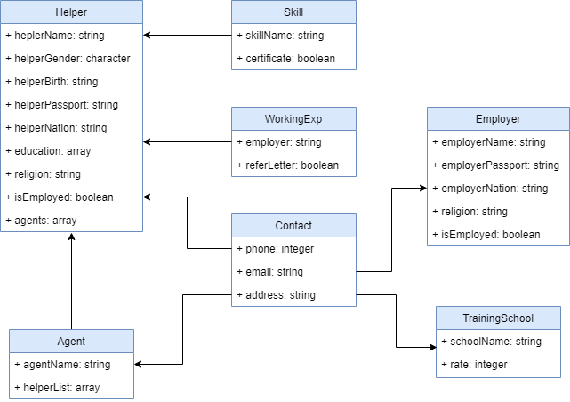
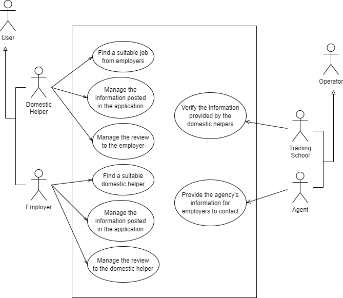
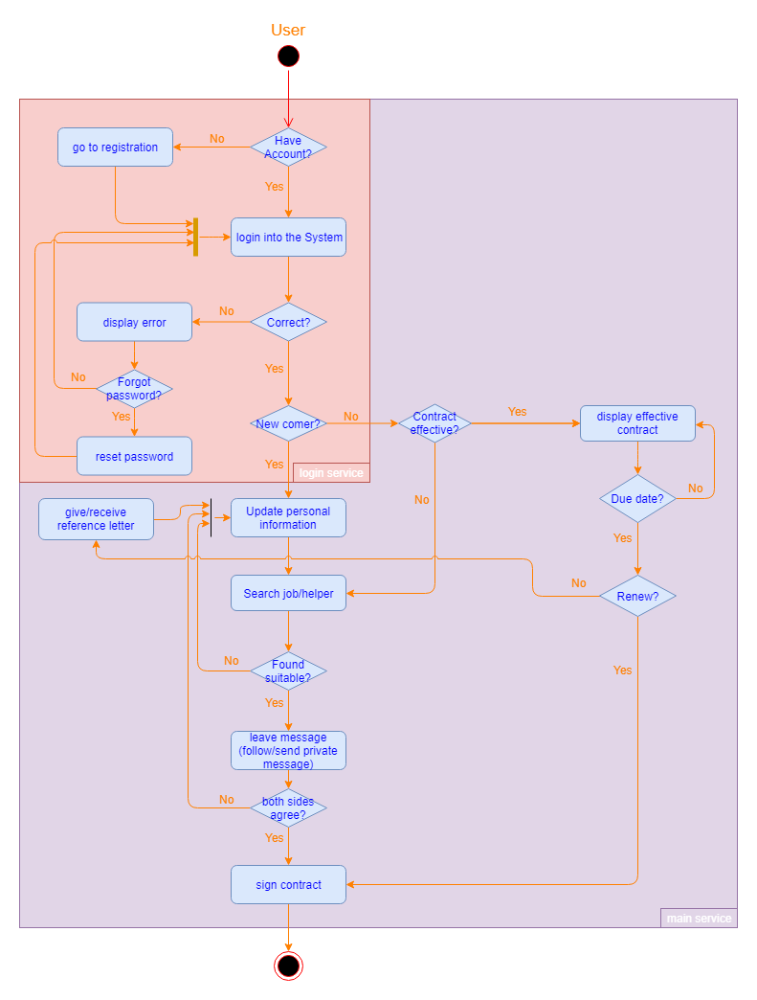
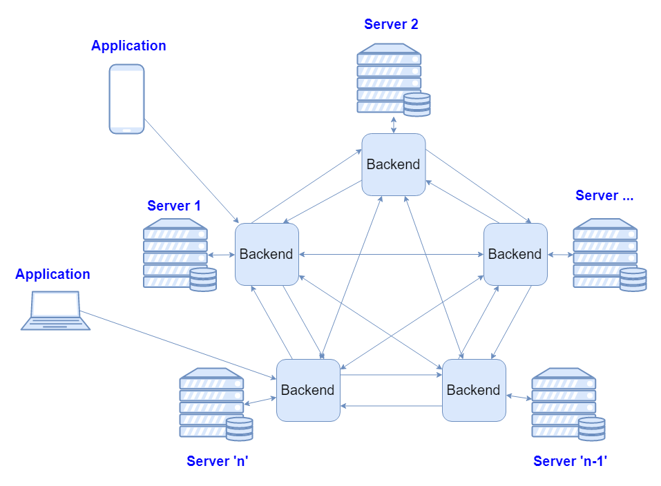
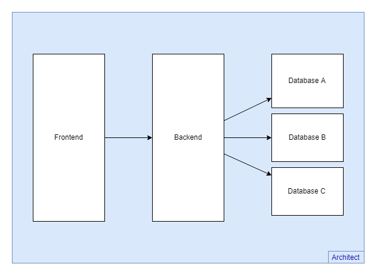

## 2.1. Design

### 2.1.1. Data Model



Figure 2.1.1 shows the Entity Relational Diagram of our database storing identification.
There are seven tables namely Helper, Agent, Employer, TrainingSchool, Skill, WorkingExp and Contact.
The ERD is prepared for the relational database in our system in purpose by implementing login service.

### 2.1.2. Functional Use Cases



Figure 2.1.2 shows the use cases of 4 specific users:
Domestic Helper:
1. Manage the information posted in the system
    - Register the personal information
    - Upload relevant documents
    - Modify the information (e.g. the availability)
    - Manage the confidential levels of pieces of information (e.g. the phone number)
    - Delete the information posted

Employer:
1. Find a suitable domestic helper
    - Request a list of domestic helper information according to the specified preference
    - Obtain the history of domestic helpers' working credits
2. Upload and manage the review to the domestic helper hired

Training school (verifier):
1. Verify the information provided by the domestic helpers

Agent:
1. Update helpers' information
2. View helpers' information
3. Change status of helpers' info (i.e. show/hide the information to the public)
4. Contact employer

There is an internal opinion that the personal information of domestic helpers should be input by the agencies. We will continue to investigate this.

### 2.1.3. Security Use Cases

A commonplace account system will be deployed.

Domestic Helper/Employer/Verifier/Agent:
1. Manage the personal account of the system
    - Create a new account
    - Change the password
    - Retrieve the account if the password is forgotten
2. Login the system

### 2.1.4. Domestic Helper Use Case Specification

The domestic helper use case specification can be viewed as the key to the system.
It is supplied below.
We will continue to refine it.

#### Brief description

The use case describes how a domestic helper manages the information posted in the system.

#### Use case diagram

```
Domestic helper (actor) → Manage the information posted in the system
```

#### Basic flow

1. The use case begins when a domestic helper decides to fill in his/her information for employment.

**{Begin filling the form}**

2. The domestic helper fills in the form, where the form includes:
   1. Full name
   2. Nick name
   3. Gender
   4. Date of birth
   5. Languages
   6. Portrait photo (check if the portrait photo is up to standard)

   **{Check if the field is satisfactory}**

   7. Phone numbers (use SMS messages to verify the phone numbers from domestic helpers (advanced feature))

   **{Check if the field is satisfactory}**\
   **{Verify the field}**

   8. Email address (can be verified through sending email with verification link to the address supplied)

   **{Check if the field is satisfactory}**\
   **{Verify the field}**

   9. Social network pages (can be verified through OAuth)

   **{Verify the field}**

   10. Availability
   11. Self-introduction (only ASCII characters are allowed for easier management, and we check if there are any improper words, for example, misspelled and offensive words)

   **{Check if the field is satisfactory}**

   12. Skill set (it can be verified by third-party)
   13. Certificate (it can be verified by third-party)
   14. Comments, ratings of multiple dimensions together with the employment period from previous employers (if there are any) which is read-only (how to ensure that this is not fabricated can be a problem)

**{Submit the form}**

3. The domestic helper submits the form.

**{End filling the form}**

4. The use case ends.

#### Alternative flows

##### Invalid field (advanced feature)

At {Verify the field}, if the domestic helper selects VERIFY, but the verification process is not passed,
1. The system prompts that the verification process failed.
2. The domestic helper can ignore it and continue to fill in the form.

##### Unsatisfactory field (advanced feature)

At {Check if the field is satisfactory}, after the domestic helper filling in the field, but it is detected to be unsatisfactory,
1. The system prompts that the field is unsatisfactory and locates the problem.
2. The domestic helper can ignore it continue to fill in the form.

##### Modifying the form

At {End filling the form}, if MODIFY is selected
1. The system goes to {Begin filling the form} with fields filled with previous content.

##### Hiding some of the fields

At any point between {Begin filling the form} and {Submit the form},
1. The domestic helper can choose to hide a field.
    1. A hiding reason can be chosen, for example, the field being outdated, the field containing inaccurate information, etc.
2. The domestic helper can continue to fill in the form.



Figure 2.1.3 shows the complete workflow combining login and helper or employer finding service. Where the login part is mandatory for the user as well as minimum user information at the step "update personal information" before using the rest of the services. Noted that the step "update personal information" is aforementioned at 2.1.4. basic flow.

### 2.1.5. Network Specification



Figure 2.1.4 shows the connection between 3 different layers, namely application, backend and data storage.
Whenever requests are sent from an application to the backend, the backend will look at the location of the requested resource at first.
If the resource or the data is stored in its corresponding server, it will query its database and return the result.
If the case is the request requires multiple queries on various databases, it will deliver the request to the matching backend service base on the request.

The model involves many different companies such as training schools and agencies, but we want to simplify the network.
For this reason, we will build the layers and services under the same Domain name so that it also helps with future expansion by automatically assigning an address to the newcomer.

### 2.1.6. Hybrid Database Server

The database layer of our system is developed with both relational database and blockchain database to handle general information and data that can be certified respectively.
Hybrid Database Server brings great benefits to the control force of data because data could be queried separately.
For example, anonymous users would be blocked after doing queries on the relational database and unable to append blocks on our blockchain database.

Our relational database stores the user identity and some mandatory personal information may include but not limited to name, gender, and address.
Communication between the database layer and backend layer would be supported by smart data archiving [1] to perform varied services such as user login, renewing login and updating personal information.



Figure 2.1.5 shows the design of the blockchain database we adopted.
Our blockchain database system consists of multiple databases held by different nodes, meaning that a universal database standard is necessary for installation and operation.
Meanwhile, blockchain database is more complex in contrast to mainstream database.
Referring to BlockchainDB [2], a blockchain database consists of several distributed sharding of database linked by a blockchain system.
In our system, distributed sharding of database is held by agencies and training schools in purpose by raising the credibility with the help of the high reputation of agency and training school companies.
Domestic helpers and employers also take part in the server layer with the limitation of read and write data to prevent any unauthorized access.
To achieve this, our blockchain database allows end-users to send request for permission to nodes that hold the database they belong to.
With permission, end-users who are helpers or employers are able to interact with the system.

### References

<!-- A template for the IEEE reference style (October 2016) according to <https://www.cse.ust.hk/ct/fyp/reports/content/ieee_style.html> and <https://ieeecs-media.computer.org/assets/pdf/2016CSStyleGuide.pdf>: <author names>, "<title>," <publication name (in italic type)>, <publisher name>, <date (e.g. 15 Mar. 2000)>, <page range>; <URL>. -->
[1] "A roadmap for intelligent archiving," IBM Software, Aug. 2013; <https://www.ibm.com/downloads/cas/PA9YRY1N>.
[2] M. El-Hindi et al., "BlockchainDB - Towards a Shared Database on Blockchains," *SIGMOD '19 Proceedings of the 2019 International Conference on Management of Data*, 2019, pp. 1905–1908; <https://doi.org/10.1145/3299869.3320237>.
