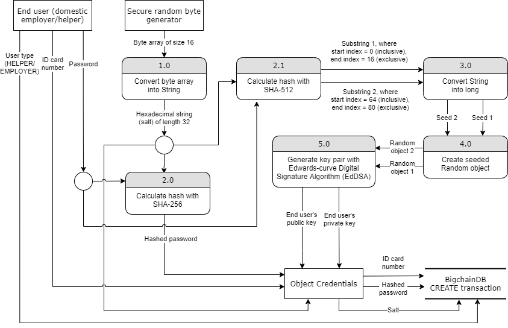

## 2.2. Implementation

### 2.2.1. BigchainDB utilization

Transactions in BigchainDB have the following content [9 (1.3)]:
```txt
{
    "id": id,
    "version": version,
    "inputs": inputs,
    "outputs": outputs,
    "operation": operation,
    "asset": asset,
    "metadata": metadata
}
```

The version of BigchainDB we have been using is 2.0, so the value of "version" is "2.0".
We utilized CREATE and TRANSFER operation.
Other operations, including "VALIDATOR_ELECTION", "CHAIN_MIGRATION_ELECTION", "VOTE", were newly included in BigchainDB 2.0.
They are currently not under our consideration.
However, they provide appealing functions.
For example, VALIDATOR_ELECTION operation apparently provides an on-chain mechanism for a BigchainDB node to initiate an election that decides whether to add a new participant node in a network.

We used the CREATE operation when a domestic helper or an employer registers in our application.
A CREATE transaction is created.
It contains basic account information, including the user type, ID card number, hashed password and salt.
That basic account information is stored in "asset".

We used the TRANSFER operation when a helper or an employer creates or updates his/her information.
A TRANSFER transaction is created.
The pieces of information can be those in the profile, job description or feedback.
They are stored in "metadata".
Recall that an asset is not changed later in a chain of transactions, but metadata can be changed in later transactions to reflect updated status.

All the transactions have one input, one output only.
The asset representing a user is transferred back to himself/herself with metadata (which contains content of his/her information) updated.

### 2.2.2. Back end languages

A back end language is required for the communications to the database and the communications to the front end.
We will briefly discuss two of the back end languages—C++ and Java.

#### C++

C++ is a programming language with both high-level and low-level features.
The development of the language started in 1979 [1].

C++ has a relatively close relationship to computer's low-level details.
Programmers can make various low-level optimizations so that the resulting program can be more efficient.
Therefore, it can be an ideal language if we want to implement an efficient blockchain system from scratch.
In fact, Bitcoin source code was written in C++ [2].

Nevertheless, C++ is prone to buffer overflow attacks if it is not used correctly.
Some C++ library functions can be attacked with buffer overflow, for instance, `strcpy (char *dest, const char *src)` and `sprintf (char *str, const char *format, ...)`.
`strcpy (char *dest, const char *src)` does not check if `src` is longer than expected when it is copied to `dest`.
If `src` is longer than expected and it is copied to `dest`, some location in the stack will be wrongly overwritten, leading to program behaviours not intended [3].
If similar vulnerabilities appear in the servers of our blockchain network, they may be exploited by attackers to rig the servers and thus the blockchain network.
In addition, C++ does not have measures against memory leaks.
C++ allows programmers to control pointers which point to resources created.
Yet, memory leaks can happen if some resources are not deallocated via pointers.
As a result, programs may crash because of this.

#### Java

Java is a high-level programming language.
The development of the language started in 1991 [4].

It is safer when compared to C++ as it is not prone to buffer overflow attacks.
The resources in Java will be recycled by the garbage collector [5].
Therefore, programmers do not have to worry about memory leaks.

As a result, Java was preferred for our back end language rather than C++.
It is a safer language without memory leaks.
Although Java programs can be slower than C++ programs, performance is not a critical issue in our application.

### 2.2.3. Security



Figure 2.2.1 reflects the current implementation of user registration.
Other than calculating the regular hashed password and generating a salt value, the application also needs to generate a key pair for a user.
The key pair is determined by the secret that only the user knows, which is the password, and the user's salt to avoid a key pair collision.
With the key pair, the user can sign his/her transactions by the private key, while no one else can fabricate the user's signatures.
Note that the hashing algorithm used in Method 2.0 cannot be the same as that in Method 2.1.
Otherwise, one with knowledge about how key pairs are generated and hashed passwords can infer the key pairs.

Initially, `net.i2p.crypto.eddsa.KeyPairGenerator`, which accepts `SecureRandom` objects, is the class responsible for generating the key pairs.
We executed the following experiment code:
```java
import java.security.SecureRandom;
import java.util.Random;

public class App {
    public static void main(String[] args) {
        SecureRandom random1 = new SecureRandom(hexStringToByteArray("86eca66b50a2c1de3037bb619f2ec661"));
        int i = random1.nextInt();
        System.out.println(i);
        i = random1.nextInt();
        System.out.println(i);
        i = random1.nextInt();
        System.out.println(i);
        System.out.println();

        random1 = new SecureRandom(hexStringToByteArray("86eca66b50a2c1de3037bb619f2ec661"));
        i = random1.nextInt();
        System.out.println(i);
        i = random1.nextInt();
        System.out.println(i);
        i = random1.nextInt();
        System.out.println(i);
        System.out.println();

        Random random2 = new Random(20);
        i = random2.nextInt();
        System.out.println(i);
        i = random2.nextInt();
        System.out.println(i);
        i = random2.nextInt();
        System.out.println(i);
        System.out.println();

        random2 = new Random(20);
        i = random2.nextInt();
        System.out.println(i);
        i = random2.nextInt();
        System.out.println(i);
        i = random2.nextInt();
        System.out.println(i);
    }

    /**
     * [6]
     *
     * @param s A hexadecimal string, e.g. "86eca66b50a2c1de3037bb619f2ec661"
     *          (capital letters and small letters both work)
     */
    private static byte[] hexStringToByteArray(String s) {
        int len = s.length();
        byte[] data = new byte[len / 2];
        for (int i = 0; i < len; i += 2) {
            data[i / 2] = (byte) ((Character.digit(s.charAt(i), 16) << 4) + Character.digit(s.charAt(i + 1), 16));
        }
        return data;
    }
}
```

The result of execution 1 with JDK 11.0.5:
```txt
1627055688
454542455
333519441

105059482
-1444595062
141898296

-1150867590
-1704868423
884779003

-1150867590
-1704868423
884779003
```

The result of execution 2 with JDK 11.0.5:
```txt
1627055688
454542455
333519441

105059482
-1444595062
141898296

-1150867590
-1704868423
884779003

-1150867590
-1704868423
884779003
```

Even after "re-initializing" with the same seed, the `SecureRandom` object did not produce the same result.
However, with JDK 11.0.5, different executions yielded the same random series.

The result of execution 1 with [7]:
```txt
1627293594
259957378
1015543383

-2146931601
-1456576034
-636827118

-1150867590
-1704868423
884779003

-1150867590
-1704868423
884779003
```

The result of execution 2 with [7]:
```txt
-581304511
1563641731
294076583

546097315
2132293268
-1426670930

-1150867590
-1704868423
884779003

-1150867590
-1704868423
884779003
```

A different behaviour of the `SecureRandom` object was observed.
In this case, different executions yielded different random series.
Yet, we could see that the `Random` object always produced the same random series for different executions.
Also, the `Random` object could be re-initialized.

It was observed that `SecureRandom` objects could not be re-initialized properly such that key pairs could not be generated properly.
Therefore, `net.i2p.crypto.eddsa.KeyPairGenerator` was cloned and modified to be `DeterministicKeyPairGenerator`.
`DeterministicKeyPairGenerator` accepts `Random` objects instead of `SecureRandom` objects.

There was another problem: how many inputs are expected to find a collision of key pairs?

Suppose we have $M$ inputs, then there will be $\binom{M}{2}$ comparisons of pairs.
There are $2^N$ different possible inputs.

We would like to find a collision, so we set $\binom{M}{2} = 2^N$.

Taking $\binom{M}{2} \approx M^2$, $\binom{M}{2} = 2^N \implies M^2 = 2^N \implies M = 2^{\frac{N}{2}}$ [8].

A `Random` object takes `long` as the seed.
So, $2^{\frac{64}{2}} \approx 4.29 \ \textrm{billion inputs}$ are expected to find a collision of key pairs with one `Random` object.
We wanted the expected number of inputs to find a collision to be higher, so we used two `Random` objects such that the expected number of inputs becomes $2^{\frac{64 \cdot 2}{2}} \approx 1.84 \times 10^{19}\ \textrm{inputs}$.

### 2.2.4. Encryption Approaches

The following are the encryption approaches commonly implemented in blockchain, SHA-256 and X11.

#### SHA-256

SHA-256, which stands for Secure Hashing Algorithms, is one of the most popular hashing methods nowadays.
It was invented by the National Security Agency (NSA) in 2001, as an improvement of SHA-1.
It is implemented by dividing the data message into N blocks with 512 bits each and every block carries 15 32-bit input blocks.
For each 512-bit block, a message schedule W is created by combining the required block and three other shuffled blocks obtained by formulas.
Through some complicated calculations, a new hash value will be produced [17].

This algorithm is commonly implemented in various blockchain systems, such as Bitcoin [18], with the reasons below.
The maximum amount of data messages being able to be transformed is 2⁶⁴ bit, while each of them is fixed as 256 bits, as the method's name states [19].
With a larger hashing length, the security level would be improved.
Furthermore, the method is currently resistant to hash collision attack with a very low collision rate [20].
No identical hashes will be produced and this, therefore, prevents the hackers from substituting one hashed value for another and increases their difficulty to gain the data.

However, the structure and mathematical operations of SHA-256 are similar to those of the previous version SHA-1, which was cracked successfully in 2017.
As a result, it is believed that SHA-256 might be compromised in the upcoming future [21].

#### X11

X11 is a newer hashing algorithm compared to the former, which was created by Dash core developer in 2004.
It applies 11 individual hashing algorithms, for example, BLAKE, BLUE MIDNIGHT WISH (BMW), Grøstl, JH, Keccak, Skein, Luffa, CubeHash, SHAvite-3, SIMD, ECHO, for the proof-of-work [22].
According to the official website, it is an improved version of another chained-hashing approach called Quark.
The former increases the amount of hashes in the hope of building a more complex and deeper algorithm.
Besides, the rounds of hashes are no longer randomly selected, instead, they are fixed [23].

With the huge number of various rounds of hashes, it can provide a safer and more sophisticated hashing algorithm.
Compared to SHA-256, which is single-hash, it is more protective against Single Point Of Failure (SPOF), an example of security dangers.
This implies that the entire system is able to keep functioning until the 11 hashes are cracked at the same time.
If one of the hashes is determined as unreliable, warning will be alerted, and that hash can be replaced by other more secure hash later on.
Therefore, both the reliability and security level of X11 are higher than those of SHA-256.

Despite of more secure, due to the complicated calculation of 11 hashing algorithms, the memory requirement becomes one of the concerns of X11 [24].
Dealing with the large amount of algorithm requires a lot of storage and ram in the system.

### 2.2.5. Verification

We introduce verification in our system.
Verification is introduced so that, for example, before domestic helpers submitting their information (e.g. phone number), the information submitted can be verified to be genuine.
The fact that one piece of information is verified can be shown to the employers so that they are more confident with the authenticity of the information.
Verification can be implemented by service like OAuth, which is taken as an example to study verification.

#### OAuth

Normally, OAuth is used to provide a mechanism for system implementers to allow users of their systems to login the systems without creating an extra account [25].
In our implementation, we can utilize OAuth to bind the domestic helper profiles to online social networking accounts and verify the account.

OAuth of version 2.0 has four different modalities that determine how an "access_token" is issued.
While there are different flows for different modalities, an "access_token" can always be obtained at the end.
With the "access_token", we can ensure that a user owns the account.
A modality, "implicit grant" best matches our purpose since the "access_token" will be issued immediately after the user login the outside authorization system without further overhead.
There are other modalities, for example, "authorization code grant" provides a more complete flow that introduces overhead which is not necessarily useful [26].

### References

<!-- The preferred reference style is IEEE reference style (version 11.12.2018). See <https://www.cse.ust.hk/ct/fyp/reports/content/ieee_style.html> and <http://journals.ieeeauthorcenter.ieee.org/wp-content/uploads/sites/7/IEEE-Reference-Guide.pdf>.
- Format for websites: [author names]. "[page title]." [website title]. [URL] (accessed [date of access (e.g. Mar. 1, 2000/ Mar. 2000)]).
- Format for books: [author names], "[chapter title]," in [book title (in italic type)], [edition number]th ed. [publisher city], [publisher US state], [publisher country]: [publisher name], [year], ch. [chapter number], sec. [section number], [page range].
- Format for online conference proceedings: [author names], "[paper title]," in [conference name (in italic type)], [year], [page range]. [Online]. Available: [URL]
- Format for lecture notes: [author names]. ([year]). [lecture title] [[type of medium]]. Available: [URL]
- Format for online manuals: [author names]. [manual title (in italic type)], [edition number]th ed. ([year]). Accessed: [date of access]. [Online]. Available: [URL]
- Format for online reports: [author names], "[report title]," [company name], [company city], [company US state], [company country], Rep. [report number], [date]. Accessed: [date of access]. [Online]. Available: [URL]
- Format for online videos: [video owner/creator], [location]. [video title (in italic type)]. [release date]. Accessed: [date of access]. [Online Video]. Available: [URL] -->
<!-- [9 (1.3)] T. McConaghy. "BigchainDB Transactions Spec v2." GitHub. <https://github.com/bigchaindb/BEPs/tree/master/13> (accessed Dec. 26, 2019). -->
[1] Albatross. "History of C++." cplusplus.com. <http://www.cplusplus.com/info/history/> (accessed Feb. 27, 2019).\
[2] A. Rosic. "Blockchain Tutorial | How To Become A Blockchain Developer." Blockgeeks. <https://blockgeeks.com/guides/blockchain-developer/> (accessed Jul. 7, 2019).\
[3] <!-- Lecture note -->W. Shuai. (2019). "Software Exploitation: Buffer Overflow." Principles of Cybersecurity (Dept. of Computer Science and Engineering, HKUST) [Powerpoint slides].\
[4] "History of Java." JavaTpoint. <https://www.javatpoint.com/history-of-java> (accessed Feb. 27, 2019).\
[5] <!-- Lecture note -->N. Lam. (2019). "Classes and Objects." Java Programming (Dept. of Computer Science and Engineering, HKUST) [Powerpoint slides].\
[6] L. Dave. "Convert a string representation of a hex dump to a byte array using Java?" Stack Overflow. <https://stackoverflow.com/a/140861>  (accessed Feb. 15, 2020).\
[7] "GDB online Debugger." OnlineGDB. <https://www.onlinegdb.com/> (accessed Feb. 15, 2020).\
[8] <!-- Lecture note -->W. Shuai. (2019). "Hash Function Lecture Note." Principles of Cybersecurity (Dept. of Computer Science and Engineering, HKUST) [Handwritten notes].\
[17] C. Bellet. "Part 5: Hashing with SHA-256." Medium. <https://medium.com/biffures/part-5-hashing-with-sha-256-4c2afc191c40> (accessed Sep. 2019).\
[18] B. Asolo. "What Is SHA-256 And How Is It Related to Bitcoin?" Mycryptopedia. <https://www.mycryptopedia.com/sha-256-related-bitcoin/> (accessed Sep. 2019).\
[19] P. Nohe. "Re-Hashed: The Difference Between SHA-1, SHA-2 and SHA-256 Hash Algorithms." hashedout. <https://www.thesslstore.com/blog/difference-sha-1-sha-2-sha-256-hash-algorithms/> (accessed Sep. 2019).\
[20] <!-- Conference proceedings with DOI -->J. N. Soliman, T. A. Mageed and H. M. El-Hennawy, "Digital Signature and Authentication Mechanisms Using New Customized Hash Function for Cognitive Radio Networks," in *IEEE International Conference on Computer Engineering and Systems*, 2017, pp. 175–181, doi: 10.1109/ICCES.2017.8275299\
[21] "Hashing Algorithms." Jscrambler. <https://blog.jscrambler.com/hashing-algorithms/> (accessed Sep. 2019).\
[22] B. Asolo. "X11 Algorithm Explained." Mycryptopedia. <https://www.mycryptopedia.com/x11-algorithm-explained/> (accessed Sep. 2019).\
[23] "X11 Hash Algorithm." Dash. <https://docs.dash.org/en/stable/introduction/features.html#x11-hash-algorithm> (accessed Sep. 2019).\
[24] Z. v. Naumann. "The Evolution of the Cryptographic Hash Function in Blockchains." Medium. <https://medium.com/shokone/hash-no-not-that-kind-the-crypto-kind-2e8bf616aa24> (accessed Sep. 2019).\
[25] W. Gordon. "Understanding OAuth: What Happens When You Log Into a Site with Google, Twitter, or Facebook." Lifehacker. <https://lifehacker.com/understanding-oauth-what-happens-when-you-log-into-a-s-5918086> (accessed Sep. 2019).\
[26] L. Spyna. "An OAuth 2.0 introduction for beginners." ITNEXT. <https://itnext.io/an-oauth-2-0-introduction-for-beginners-6e386b19f7a9> (accessed Sep. 2019).
