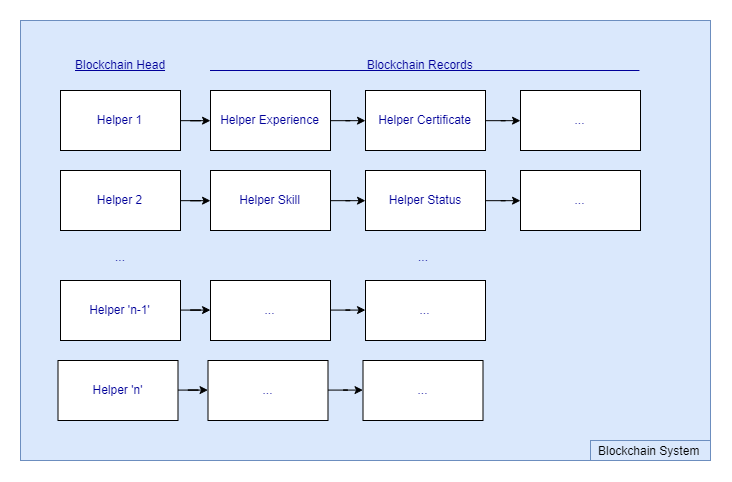

## 2.2. Implementation

### 2.2.1. Blockchain Operation

Figure 6 shows the use of the blockchain system.
Our Blockchain database restricts users to operate the database through a blockchain under the supervision of the smart contract [13 (1.1)].
Therefore, the backend layer will implement the blockchain operation as the base class for all derived class operations as well as the smart contract to ensure the validity of blockchain.
According to BlockchainDB, function get(), function put() and function verify() could be implement with verification so put them inside our system.
Moreover, function delete() and function update() can be furthermore derived from 3 bases according to BigchainDB [1].
Base on the concrete model of the blockchain database, our system developed for immutable objects like CV and document can be very well organized.

### 2.2.2. Standard Database for System

The version of the backend and the database will be identical for all nodes holding database.
Therefore, the database chosen need to be ensured to be suitable for the blockchain database at first preventing changes after the User Acceptance Test passed and becoming released as it might cause essential data loss.
Certain kinds of databases are under our consideration regarding their advantages and relationship with blockchain database:
1. MongoDB
2. MySQL
3. SQL server

On the aspect of prices, MongoDB and MySQL are free to use while SQL server requires a license.
It could raise the expenditure during development and also the product releasing phase.

On the aspect of function, MongoDB belongs to NoSQL while MySQL and SQL server are relational database.
Which means MySQL and SQL server require a strict schema for tables and records while MongoDB is more depend on the key-value pair [2] rather than the database schema.
It brings to the advantage to use MongoDB: the database could process different shapes of data such as helper's certificate, helper's working experience and reference letter.

On the aspect of native support, SQL server is natively supported by Microsoft Azure [3] with blockchain database solution, but still being a need for us to tailor the server for the system requirement.

### 2.2.3. Back End Languages

A backend layer is required for communication between frontend layer and database layer, and therefore a backend language is considered important in our project.
Here are two common languages implemented in back end, C++ and Java.

#### C++

C++ is a general-purpose language with both high-level and low-level features.
It is the more advanced version of C, which was started to develop in 1979 [4].
C++ does not only support procedural programming like what C does, but also additionally allows object-oriented programming [5].
For the compilation process, source code written in C++ is first translated into object code, and then machine code.

Since different operating systems obtain different machine code for the same program and recompilation is required when the platform is changed, C++ is described as platform-dependent [6].
C++ provides a lot of useful features, like generic programming, multiple inheritances and operator overloading, which makes it more flexible.
C++ allows users to access memory by utilizing pointer, and thus the possibility of memory leakage is higher if the pointer is not properly handled [7].

Communication between C++ interface and database servers can only be allowed through connectors.
Generally, numerous server companies provide their specific C++ driver for connection, for example, MongoDB C++ driver [8] and MySQL Connector/C++ [9].
For SQL server, either ODBC (Open DataBase Connectivity) or OLE DB (Object Linking and Embedding database) helps with connection.
Both of them are universal APIs while the former one is claimed to be simpler and much faster than the latter one [10].

#### Java

Java is a high-level programming language invented in 1991 [11].
Its compilation method differs from the traditional ones’ by compiling the program to a bytecode, instead of compiling it to machine code or interpreting it from source code at program runtime.
The bytecode obtained in the former one is then run by Java Virtual Machine (JVM) [12].

With the above feature, Java is platform-independent, implying that no recompilation is needed even the program is implemented in various platforms.
Java is also object-oriented with restricted pointer, whose memory is mainly controlled by the system, and therefore has a lower opportunity to have memory leakage compared to C++ [13].

Java supports the vast majority of database servers, with its Java DataBase Connectivity (JDBC), like MongoDB [14], MySQL [15] and SQL server [16].
Being a generic universal API, JDBC has the advantage of high portability and the ability of running the program on different machines.

### 2.2.4. Encryption Approaches

The following are the encryption approaches commonly implemented in blockchain, SHA-256 and X11.

#### SHA-256

SHA-256, which stands for Secure Hashing Algorithms, is one of the most popular hashing methods nowadays.
It was invented by the National Security Agency (NSA) in 2001, as an improvement of SHA-1.
It is implemented by dividing the data message into N blocks with 512 bits each and every block carries 15 32-bit input blocks.
For each 512-bit block, a message schedule W is created by combining the required block and three other shuffled blocks obtained by formulas.
Through some complicated calculations, a new hash value will be produced [17].

This algorithm is commonly implemented in various blockchain systems, such as Bitcoin [18], with the reasons below.
The maximum amount of data messages being able to be transformed is 2⁶⁴ bit, while each of them is fixed as 256 bits, as the method's name states [19].
With a larger hashing length, the security level would be improved.
Furthermore, the method is currently resistant to hash collision attack with a very low collision rate [20].
No identical hashes will be produced and this, therefore, prevents the hackers from substituting one hashed value for another and increases their difficulty to gain the data.

However, the structure and mathematical operations of SHA-256 are similar to those of the previous version SHA-1, which was cracked successfully in 2017.
As a result, it is believed that SHA-256 might be compromised in the upcoming future [21].

#### X11

X11 is a newer hashing algorithm compared to the former, which was created by Dash core developer in 2004.
It applies 11 individual hashing algorithms, for example, BLAKE, BLUE MIDNIGHT WISH (BMW), Grøstl, JH, Keccak, Skein, Luffa, CubeHash, SHAvite-3, SIMD, ECHO, for the proof-of-work [22].
According to the official website, it is an improved version of another chained-hashing approach called Quark.
The former increases the amount of hashes in the hope of building a more complex and deeper algorithm.
Besides, the rounds of hashes are no longer randomly selected, instead, they are fixed [23].

With the huge number of various rounds of hashes, it can provide a safer and more sophisticated hashing algorithm.
Compared to SHA-256, which is single-hash, it is more protective against Single Point Of Failure (SPOF), an example of security dangers.
This implies that the entire system is able to keep functioning until the 11 hashes are cracked at the same time.
If one of the hashes is determined as unreliable, warning will be alerted, and that hash can be replaced by other more secure hash later on.
Therefore, both the reliability and security level of X11 are higher than those of SHA-256.

Despite of more secure, due to the complicated calculation of 11 hashing algorithms, the memory requirement becomes one of the concerns of X11 [24].
Dealing with the large amount of algorithm requires a lot of storage and ram in the system.

### 2.2.5. Verification

We introduce verification in our system.
Verification is introduced so that, for example, before domestic helpers submitting their information (e.g. phone number), the information submitted can be verified to be genuine.
The fact that one piece of information is verified can be shown to the employers so that they are more confident with the authenticity of the information.
Verification can be implemented by service like OAuth, which is taken as an example to study verification.

#### OAuth

Normally, OAuth is used to provide a mechanism for system implementers to allow users of their systems to login the systems without creating an extra account [25].
In our implementation, we can utilize OAuth to bind the domestic helper profiles to online social networking accounts and verify the account.

OAuth of version 2.0 has four different modalities that determine how an "access_token" is issued.
While there are different flows for different modalities, an "access_token" can always be obtained at the end.
With the "access_token", we can ensure that a user owns the account.
A modality, "implicit grant" best matches our purpose since the "access_token" will be issued immediately after the user login the outside authorization system without further overhead.
There are other modalities, for example, "authorization code grant" provides a more complete flow that introduces overhead which is not necessarily useful [26].

### References

<!-- [13 (1.1)] A. Arasu, C. Binnig, D. Kossmann, M. El-Hindi, M. Heyden and R. Ramamurthy, "BlockchainDB - Towards a Shared Database on Blockchains," SIGMOD '19 Proceedings of the 2019 International Conference on Management of Data, Amsterdam, Netherlands, 2019. -->
[1] J. Pregelj, "CRAB — Create. Retrieve. Append. Burn.," BigChainDB, Oct 19, 2017. [Online]. Available: <https://blog.bigchaindb.com/crab-create-retrieve-append-burn-b9f6d111f460>.\
[2] "NoSQL Databases Explained," MongoDB, [Online]. Available: <https://www.mongodb.com/nosql-explained>.\
[3] "Blockchain," Microsoft Azure, [Online]. Available: <https://azure.microsoft.com/en-us/solutions/blockchain/>.\
[4] Albatross, "History of C++," cplusplus, [Online]. Available: <http://www.cplusplus.com/info/history/>.\
[5] "What is the difference between C and C++?" cs-Fundamentals.com, [Online]. Available: <http://cs-fundamentals.com/tech-interview/c/difference-between-c-and-cpp.php>.\
[6] "Java vs. C++ architecture, C++ memory model," [Online]. Available: <http://courses.washington.edu/css342/zander/css332/arch.html>.\
[7] Varun, "What is a Memory Leak in C++?" thispointer.com, Jun 27, 2015. [Online]. Available: <https://thispointer.com/what-is-memory-leaks-in-c/>.\
[8] "MongoDB C++ Driver," MongoDB, [Online]. Available: <http://mongocxx.org/>.\
[9] "MySQL Connector/C++ 8.0 Developer Guide," MySQL, [Online]. Available: <https://dev.mysql.com/doc/connector-cpp/8.0/en/>.\
[10] "Connect to SQL Database using C and C++," Microsoft, Dec 12, 2018. [Online]. Available: <https://docs.microsoft.com/en-us/azure/sql-database/sql-database-develop-cplusplus-simple>.\
[11] "History of Java," JavaTpoint, [Online]. Available: <https://www.javatpoint.com/history-of-java>.\
[12] "Compilation and Execution of a Java Program," GeeksForGeeks, [Online]. Available: <https://www.geeksforgeeks.org/compilation-execution-java-program/>.\
[13] "C++ vs Java," Educba, [Online]. Available: <https://www.educba.com/c-plus-plus-vs-java/>.\
[14] "MongoDB Java Driver," MongoDB, [Online]. Available: <https://mongodb.github.io/mongo-java-driver/>.\
[15] "MySQL Connectors," MySQL, [Online]. Available: <https://www.mysql.com/products/connector/>.\
[16] "Microsoft JDBC Driver for SQL Server," Microsoft, [Online]. Available: <https://docs.microsoft.com/en-us/sql/connect/jdbc/microsoft-jdbc-driver-for-sql-server?view=sql-server-2017>.\
[17] C. Bellet, "Part 5: Hashing with SHA-256," Medium, Jan 4, 2018. [Online]. Available: <https://medium.com/biffures/part-5-hashing-with-sha-256-4c2afc191c40>.\
[18] B. Asolo, "What Is SHA-256 And How Is It Related to Bitcoin?" Mycryptopedia, Nov 1, 2018. [Online]. Available: <https://www.mycryptopedia.com/sha-256-related-bitcoin/>.\
[19] P. Nohe, "Re-Hashed: The Difference Between SHA-1, SHA-2 and SHA-256 Hash Algorithms," hashedout, Nov 9, 2018. [Online]. Available: <https://www.thesslstore.com/blog/difference-sha-1-sha-2-sha-256-hash-algorithms/>.\
[20] J. N. Soliman, "Digital Signature and Authentication Mechanisms Using New Customized Hash Function for Cognitive Radio Networks," 2017>.\
[21] Jscrambler, "Hashing Algorithms," jscrambler, Oct 18, 2016. [Online]. Available: <https://blog.jscrambler.com/hashing-algorithms/>.\
[22] B. Asolo, "X11 Algorithm Explained," Mycryptopedia, Oct 30, 2018. [Online]. Available: <https://www.mycryptopedia.com/x11-algorithm-explained/>.\
[23] "X11 Hash Algorithm," Dash, [Online]. Available: <https://docs.dash.org/en/stable/introduction/features.html#x11-hash-algorithm>.\
[24] Z. v. Naumann, "The Evolution of the Cryptographic Hash Function in Blockchains," Medium, Oct 20, 2017. [Online]. Available: <https://medium.com/shokone/hash-no-not-that-kind-the-crypto-kind-2e8bf616aa24>.\
[25] W. Gordon, "Understanding OAuth: What Happens When You Log Into a Site with Google, Twitter, or Facebook," Lifehacker, Jun 13, 2012. [Online]. Available: <https://lifehacker.com/understanding-oauth-what-happens-when-you-log-into-a-s-5918086>.\
[26] L. Spyna, "An OAuth 2.0 introduction for beginners," ITNEXT, Aug 22, 2018. [Online]. Available: <https://itnext.io/an-oauth-2-0-introduction-for-beginners-6e386b19f7a9>.
