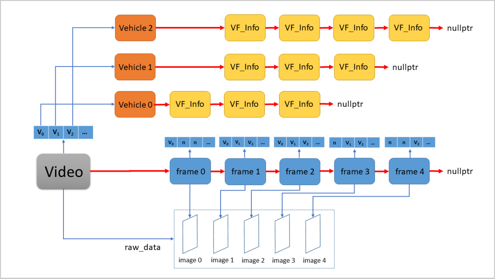

# 20191222~20191228 Getting a sample BigchainDB program into working

## Useful links

- [Documentation](https://docs.bigchaindb.com/en/latest/index.html)
- [BigchainDB server](https://github.com/bigchaindb/bigchaindb)
- [BigchainDB Java driver](https://github.com/bigchaindb/java-bigchaindb-driver)

## Preparation

### pom.xml

At the beginning of the file, we have
```xml
<project xmlns="http://maven.apache.org/POM/4.0.0" xmlns:xsi="http://www.w3.org/2001/XMLSchema-instance"
    xsi:schemaLocation="http://maven.apache.org/POM/4.0.0 http://maven.apache.org/xsd/maven-4.0.0.xsd">
```
They define the XML namespace, schema.

#### COMP 4021

XML is introduced in COMP 4021 Lecture 26 and 27.

##### COMP 4021 Lecture 26

XML is a standard for data exchange.

- Well-formed documents follow the XML syntax rules but don't have a DTD (Document Type Definition) or schema.
- Valid documents: Follow both the XML syntax rules and the rules defined in their DTD or schema.
- Invalid documents: Don't follow the XML syntax rules or the DTD or schema, if available.

##### COMP 4021 Lecture 27

- XML schemas are usually bulky compared to DTDs.
- XML DTD is more document centric while XML Schema is more database centric.

### Minimal POM

The minimum requirement for a POM are the following:
- project root
- modelVersion - should be set to 4.0.0
- groupId - the id of the project's group
- artifactId - the id of the artifact (project)
- version - the version of the artifact under the specified group

Here's an example:
```xml
<project>
    <modelVersion>4.0.0</modelVersion>
    <groupId>com.mycompany.app</groupId>
    <artifactId>my-app</artifactId>
    <version>1</version>
</project>
```

A POM requires that its groupId, artifactId, and version be configured. These three values form the project's fully qualified artifact name. This is in the form of `<groupId>:<artifactId>:<version>`. As for the example above, its fully qualified artifact name is "com.mycompany.app:my-app:1".

Also, as mentioned in the first section, if the configuration details are not specified, Maven will use their defaults. One of these default values is the packaging type. Every Maven project has a packaging type. If it is not specified in the POM, then the default value "jar" would be used.

Furthermore, you can see that in the minimal POM the repositories were not specified. If you build your project using the minimal POM, it would inherit the repositories configuration in the Super POM. Therefore when Maven sees the dependencies in the minimal POM, it would know that these dependencies will be downloaded from <http://repo.maven.apache.org/maven2> which was specified in the Super POM.

- Source: <https://maven.apache.org/guides/introduction/introduction-to-the-pom.html#Minimal_POM>

### COMP 2011 linked list

This section is for refreshing memory. It may not be useful.

```cpp
#include <iostream> /* File: ll_cnode.h */
using namespace std;

struct ll_cnode
{
    char data; // Contains useful information
    ll_cnode* next; // The link to the next node
};

const char NULL_CHAR = '\0';
ll_cnode* ll_create(char);
ll_cnode* ll_create(const char []);
int ll_length(const ll_cnode*);
void ll_print(const ll_cnode*);
ll_cnode* ll_search(ll_cnode*, char c);
void ll_insert(ll_cnode*&, char, unsigned);
void ll_delete(ll_cnode*&, char);
void ll_delete_all(ll_cnode*&);
```

```cpp
#include "ll_cnode.h" /* File: ll_delete.cpp */

// Delete the character c from the linked list.
// Do nothing if the character cannot be found.
void ll_delete(ll_cnode*& head, char c)
{
    ll_cnode* prev = nullptr; // Point to previous ll_cnode
    ll_cnode* current = head; // Point to current ll_cnode

    // STEP 1: Find the item to be deleted
    while (current != nullptr && current->data != c)
    {
        prev = current; // Advance both pointers
        current = current->next;
    }

    if (current != nullptr) // Data is found
    { // STEP 2: Bypass the found item
        if (current == head) // Special case: delete the first item
            head = head->next;
        else
            prev->next = current->next;

        delete current; // STEP 3: Free up the memory of the deleted item
    }
}
```

```cpp
#include <iostream> /* File: btree.h */
using namespace std;

struct btree_node // A node in a binary tree
{
    int data;
    btree_node* left; // Left sub-tree or called left child
    btree_node* right; // Right sub-tree or called right child
};

// Function declarations
btree_node* create_btree_node(int data);
void delete_btree(btree_node*& tree);
void print_btree(const btree_node* tree, int depth = 0);
```

```cpp
#include "btree.h" /* File: btree-print.cpp */

void print_btree(const btree_node* root, int depth)
{
    if (root == nullptr) // Base case
        return;

    print_btree(root->right, depth + 1); // Recursion: right subtree

    for (int j = 0; j < depth; j++) // Print the node data
        cout << '\t';
    cout << root->data << endl;

    print_btree(root->left, depth + 1); // Recursion: left subtree
}
```

### COMP 2011 Assignment 3 (Video Monitoring)

The structure:


One improvement for my original implementation is to write some debugging helper functions to print out the structures, e.g. `Frame`, `Vehicle`.

### Testing from COMP 3111 Project

JUnit tests are used.

An example test:
```java
public class ItemTest {
    @Test
    public void testCreation() {
        Item i = new Item();
        assertNotNull(i);
    }

    // ...
}
```

The tests are launchable from the view "Gradle Tasks" (the view "Gradle Executions" is opened to monitor the executions).

## Steps taken

1. Created a new Maven project ("Artifact Id": "maven-archetype-quickstart") through Eclipse IDE for Enterprise Java Developers 2019-09 R.
2. Copied and pasted a sample driver code from <https://gist.github.com/innoprenuer/d4c6798fe5c0581c05a7e676e175e515>.
3. Downloaded BigchainDB server repository from <https://github.com/bigchaindb/bigchaindb>. Executed `make run` using Git Bash.

### Errors

#### "The method...must override a superclass method"

Search term used: "eclipse must override a superclass method".

- Right click the project.
- Go to "Properties >> Java Compiler".
- Uncheck "Use compliance from execution environment on the 'Java Build Path'".
- Select "1.6" for the complier compliance level.
- Go to "Java Build Path >> Libraries".
- Add JRE System Library (version 1.6) and delete any other JRE System Libraries.

#### "java.lang.UnsupportedClassVersionError...Unsupported major.minor version 52.0"

Search term used: "UnsupportedClassVersionError". As one can see in the error message, the version of the JRE the class file is compatible with is "52.0".

```txt
Java SE 13 = 57,
Java SE 12 = 56,
Java SE 11 = 55,
Java SE 10 = 54,
Java SE 9 = 53,
Java SE 8 = 52,
Java SE 7 = 51,
Java SE 6.0 = 50,
Java SE 5.0 = 49,
JDK 1.4 = 48,
JDK 1.3 = 47,
JDK 1.2 = 46,
JDK 1.1 = 45
```

JDK 11 is used instead of JRE 1.6.

#### SLF4J (Simple Logging Facade for Java)

Error message:
```txt
SLF4J: Failed to load class "org.slf4j.impl.StaticLoggerBinder".
SLF4J: Defaulting to no-operation (NOP) logger implementation
SLF4J: See http://www.slf4j.org/codes.html#StaticLoggerBinder for further details.
```

`BigchainDbConfigBuilder` makes use of SLF4J. Include the following in pom.xml:
```xml
<dependency>
    <groupId>org.slf4j</groupId>
    <artifactId>slf4j-simple</artifactId>
    <version>1.7.30</version>
</dependency>
```

`BigchainDbConfigBuilder` uses `log.debug(/* ... */)`. The debug message is not printed in the console log. This can be fixed by including `-Dorg.slf4j.simpleLogger.defaultLogLevel=debug` in "VM arguments" field from "Run >> Run Configurations... >> Arguments". Search terms used:
- "slf4j log level configuration"
- "eclipse how to set system properties in java"

#### `setOutputIndex` accepting a String object instead of an Integer object

Use BigchainDB driver version 1.2 instead of 1.0.

## Questions and Answers

### What are the differences between single-node setup and multi-node setup?

For multi-node setup, more than one URL are provided to `BigchainDBConfigBuilder`. (The connection is set by `BigchainDBConfigBuilder`.)

### Why should public keys and private keys be prepared?

The public key is used as an identifier for the end user. An input for a CREATE transaction is signed by a private key. This shows that the transaction is created by that particular user but not someone else.

### How is `BigchainDBConfigBuilder` used?

It is used to configure the connection.

Single-node setup:
```java
BigchainDbConfigBuilder
    .baseUrl("https://node1.example.com/")
    .addToken("header1", <header1_value>)
    .addToken("header2", <header2_value>).setup();
```

Multi-node setup:
```java
// Define connections
Map<String, Object> conn1Config = new HashMap<String, Object>(),
    conn2Config = new HashMap<String, Object>();

// Define headers for connections
Map<String, String> headers1 = new HashMap<String, String>();
Map<String, String> headers2 = new HashMap<String, String>();

// Config header for connection 1
headers1.put("app_id", "<your-app-id>");
headers1.put("app_key", "<your-app-key>");

// Config header for connection 2
headers2.put("app_id", "<your-app-id>");
headers2.put("app_key", "<your-app-key>");

// Config connection 1
conn1Config.put("baseUrl", "https://node1.mysite.com/");
conn1Config.put("headers", headers1);
Connection conn1 = new Connection(conn1Config);

// Config connection 2
conn2Config.put("baseUrl", "https://node2.mysite.com/");
conn2Config.put("headers", headers2);
Connection conn2 = new Connection(conn2Config);

// Add connections
List<Connection> connections = new ArrayList<Connection>();
connections.add(conn1);
connections.add(conn2);
// ...You can add as many nodes as you want

BigchainDbConfigBuilder
    .addConnections(connections)
    .setTimeout(60000) // Override default timeout of 20000 milliseconds
    .setup();
```

### What is the role of the server?

Maintaining the blockchain.

### `sendTransaction`?

A transaction is sent to the server by `sendTransaction`.

### WebSocket (<https://github.com/bigchaindb/java-bigchaindb-driver#example-setup-config-with-websocket-listener>)?

WebSocket is a communication protocol featuring two-way interactive communication.

### API Wrapper (<https://github.com/bigchaindb/java-bigchaindb-driver#api-wrappers>)?

They are similar to the method headers. The information of which exception is thrown can be helpful.

## Results

Eclipse console output with debug information:
```txt
[main] INFO com.bigchaindb.builders.BigchainDbConfigBuilder - Connected to node - http://localhost:9984/ after 0 retry(s)...
(*) Keys Generated
GfHq2tTVk9z4eXgyX3xrxgJx5gR7ttXNmnz5i2iBpp6K87GkHNTAHt5rsDMc
2mWNaEKEJrtB1rEvHsFx8aM4gSQw5DjAJft6FMrfmfqgbESH3JqPPhh7efx8U8TbFp
(*) Assets Prepared
(*) Metadata Prepared
[main] DEBUG com.bigchaindb.api.TransactionsApi - sendTransaction Call :{"asset":{"data":{"Age":"Doesn't matter","Name":"James Bond","Purpose":"Saving the world"}},"id":"d9af565b042d682208fd0794272636789096ed8ad8a7d3a8c6f3718ab94402e6","inputs":[{"fulfillment":"pGSAIPiiVA1MawiHAMv6arFcCjGog0yXeOr1qp1uuhs4tcx7gUDaHD9BptVHc0AbNO9ekOvpGaib7m_RSZm11P3So_NaakvP0vf9UyyHwmfhVnZ0uBcWaq0Fhf05jzm4vR9t-OwE","fulfills":null,"owners_before":["HjZg37MiGcrFEQVLVpAi56kUaHsQWsDkBbW5HP6Wdj3G"]}],"metadata":{"Where is he now?":"Thailand"},"operation":"CREATE","outputs":[{"amount":"1","condition":{"details":{"public_key":"HjZg37MiGcrFEQVLVpAi56kUaHsQWsDkBbW5HP6Wdj3G","type":"ed25519-sha-256"},"uri":"ni:///sha-256;uzgwlWXZKI6KMZEuB2IvKtB8_-J_DHMt01fDbPEUAMc?fpt=ed25519-sha-256&cost=131072"},"public_keys":["HjZg37MiGcrFEQVLVpAi56kUaHsQWsDkBbW5HP6Wdj3G"]}],"version":"2.0"}
(*) CREATE Transaction sent - d9af565b042d682208fd0794272636789096ed8ad8a7d3a8c6f3718ab94402e6
(*) Transfer Metadata Prepared
pushedSuccessfully
Transaction posted successfully
[main] DEBUG com.bigchaindb.api.TransactionsApi - sendTransaction Call :{"asset":{"id":"d9af565b042d682208fd0794272636789096ed8ad8a7d3a8c6f3718ab94402e6"},"id":"aa0d49cadb0be6082e6531254ec0a2f6df85c37cb145551821c80af3bf81b52a","inputs":[{"fulfillment":"pGSAIPiiVA1MawiHAMv6arFcCjGog0yXeOr1qp1uuhs4tcx7gUCgvxj1HFkT5_RnOQ3Vea4KFlkCl2-NGpl4tfZ4mImA8A2I63UQ6KR0FHlcLbFekUQh_P8_OnRNo1hL_D-g0iID","fulfills":{"output_index":0,"transaction_id":"d9af565b042d682208fd0794272636789096ed8ad8a7d3a8c6f3718ab94402e6"},"owners_before":["HjZg37MiGcrFEQVLVpAi56kUaHsQWsDkBbW5HP6Wdj3G"]}],"metadata":{"Where is he now?":"Japan"},"operation":"TRANSFER","outputs":[{"amount":"1","condition":{"details":{"public_key":"HjZg37MiGcrFEQVLVpAi56kUaHsQWsDkBbW5HP6Wdj3G","type":"ed25519-sha-256"},"uri":"ni:///sha-256;uzgwlWXZKI6KMZEuB2IvKtB8_-J_DHMt01fDbPEUAMc?fpt=ed25519-sha-256&cost=131072"},"public_keys":["HjZg37MiGcrFEQVLVpAi56kUaHsQWsDkBbW5HP6Wdj3G"]}],"version":"2.0"}
(*) TRANSFER Transaction sent - aa0d49cadb0be6082e6531254ec0a2f6df85c37cb145551821c80af3bf81b52a
pushedSuccessfully
Transaction posted successfully
```

Eclipse console output without debug information:
```txt
[main] INFO com.bigchaindb.builders.BigchainDbConfigBuilder - Connected to node - http://localhost:9984/ after 0 retry(s)...
(*) Keys Generated
GfHq2tTVk9z4eXgyX3xrxgJx5gR7ttXNmnz5i2iBpp6K87GkHNTAHt5rsDMc
2mWNaEKEJrtB1rEvHsFx8aM4gSQw5DjAJft6FMrfmfqgbESH3JqPPhh7efx8U8TbFp
(*) Assets Prepared
(*) Metadata Prepared
(*) CREATE Transaction sent - d9af565b042d682208fd0794272636789096ed8ad8a7d3a8c6f3718ab94402e6
(*) Transfer Metadata Prepared
pushedSuccessfully
Transaction posted successfully
(*) TRANSFER Transaction sent - aa0d49cadb0be6082e6531254ec0a2f6df85c37cb145551821c80af3bf81b52a
pushedSuccessfully
Transaction posted successfully
```
