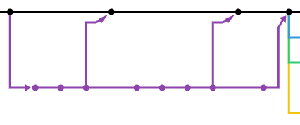
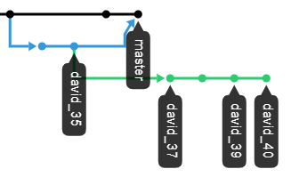
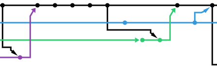
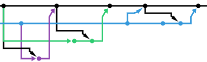
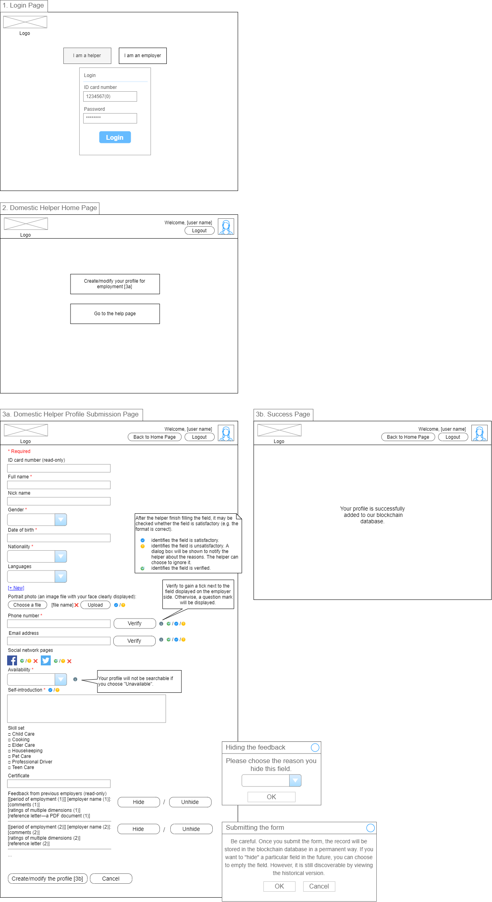
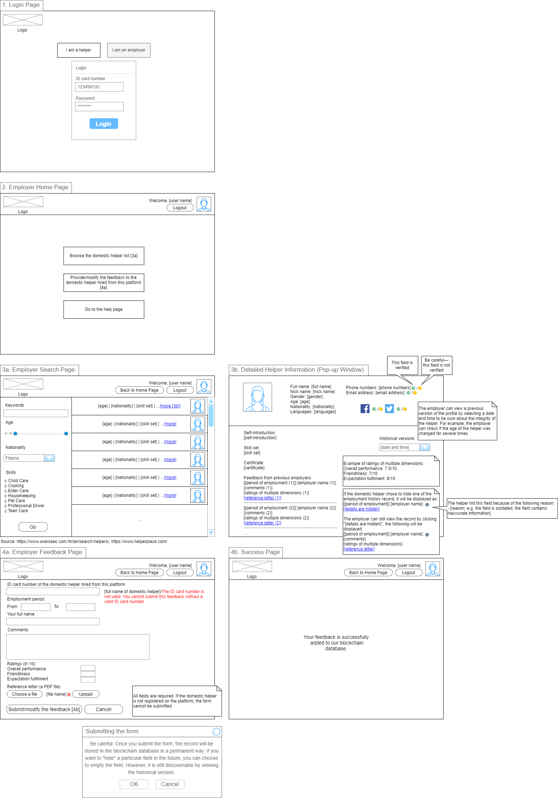
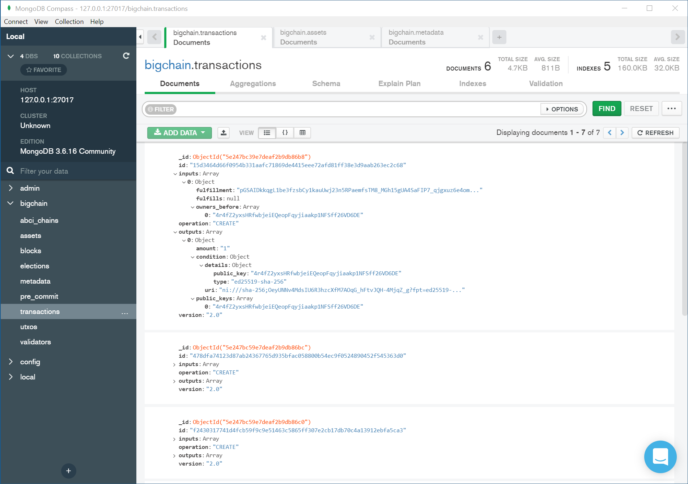

**Try directly edit this post.**

## Coding

- [ ] Building the web UI (check out Linda's "blockchain_dev" repository)
- [ ] Retrieving essential information from the database to log in and after the login for the [console app](https://github.com/davidtang1006/FYP-Code/tree/david_42/test-projects/bigchaindb-java-driver)
- [ ] Allowing users to record more information for the console app
- [ ] Testing BigchainDB multi-node setup
- [ ] Demonstrating fault tolerance for BigchainDB
- [ ] Understanding inner workings of BigchainDB

## Documenting

- [ ] Writing minutes
- [ ] Writing monthly report for November
- [ ] Writing monthly report for December/January
- [ ] Writing progress report

## Suggestions

- Leave your name after the task name above like "... (David)" to indicate that you are working on it.
- Work on one task at a time.
- Try not to work on the same task the other person is working on to avoid conflicts.

By the way, for Git branching, do something like this:\
\
\
, but not this:\
\

Reason: The former approach should be clearer.

## Task descriptions

### Building the web UI

- Build the web UI shell for the application. Make sure that the display is fine. (Do not worry about the actual functions. They are supposed to be implemented in the console app.)
- Show that the UI can trigger methods in the back end code (console app methods).

The UI is suggested as follows (if you have improvements, do tell).\
\

### Retrieving essential information from the database to log in and after the login for the console app

- Use the information from the database to authenticate and log in.
- Retrieve user information (especially the latest transaction ID) from MongoDB after the login.

Refer to `com.helperlinker.bigchaindb.services.MongoDBServices` to see how to query the database. `helperLogin(String idCardNum, String pwd)` in `com.helperlinker.bigchaindb.AppDriver` implements the current login mechanism.

### Allowing users to record more information for the console app

Currently, only helper self-introductions are recorded. More information can be recorded in a similar manner. See the corresponding TODOs in `com.helperlinker.bigchaindb.users.Employer` and `com.helperlinker.bigchaindb.users.Helper`.

## Notes

The task "visualising blockchain for debugging and demonstration" mentioned in the planning stage can be regarded as fulfilled as it turns out that [MongoDB Compass](https://www.mongodb.com/products/compass) lays out data stored in BigchainDB quite nicely without any special configurations.

